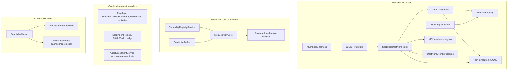
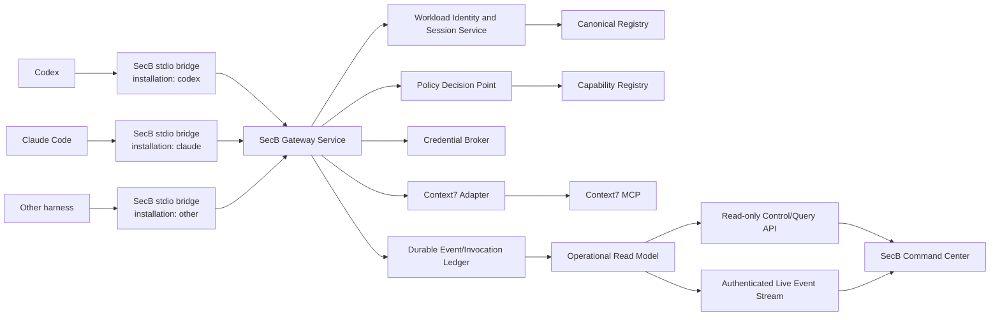
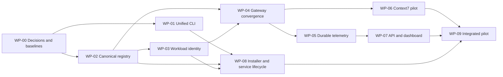

# SecB Agent Registry, MCP Gateway, CLI and Live Operations — Product Requirements Document

## Document control

| Field | Value |
|---|---|
| Document ID | `SECB-PRD-AGENT-MCP-001` |
| Version | `0.1.0-draft` |
| Status | `DRAFT / NOT EFFECTIVE` |
| Product | SecB Agent Command Center and MCP/A2A Federation |
| Product owner | Unassigned — operator to appoint |
| Architecture owner | Unassigned — operator to appoint |
| Producer | Codex architecture/product planning session |
| Produced at | 2026-07-31 |
| Repository | `C:\laragon\www\SecB` |
| Branch | `feat/secb-ruflo-command-center` |
| Baseline commit | `4844463b1c07985f0f8a73c37fe6fc1d41f8497d` |
| Baseline condition | Dirty working tree containing an uncommitted agent-enrollment candidate; this PRD does not accept or activate it |
| Risk classification | Candidate `R3` because identity, credentials, MCP permissions, monitoring, and security boundaries are affected |
| Mutation classification | This document is `M1` planning only; implementation work packages are expected to reach `M2` |
| Required review | Independent `REV`, `QA`, `SEC`, and human `GOV` before any authority-affecting activation |

### Authority statement

This PRD is a product and implementation candidate. It does not:

- make the Phase 0 documentation pack effective;
- approve or activate an Agent Instance, Runtime Deployment, MCP upstream, credential, policy, or gateway;
- authorize configuration of Codex, Claude Code, another harness, or a remote system;
- authorize npm, package-manager, binary, container, or service publication;
- authorize deployment, merge to `main`, or production use; or
- accept producer tests, events, telemetry, or this document as final evidence.

The controlling boundaries remain the repository [`AGENTS.md`](../../../AGENTS.md),
the documentation-specific [`docs/AGENTS.md`](../../AGENTS.md), and the
legacy effective baseline identified by the [documentation index](../../README.md).

## 1. Executive summary

SecB is intended to be the governed control plane through which Codex, Claude
Code, and other harnesses obtain identity, bounded authority, MCP capabilities,
credentials, audit, and operational visibility. The desired operator experience
is a single command:

```text
secb install
```

followed by ordinary operational commands:

```text
secb start
secb status
secb doctor
secb run --foreground
```

The intended runtime path is:

```text
Codex / Claude / other harness
→ authenticated SecB bridge
→ SecB MCP Gateway
→ identity, session, project, work-package, classification and capability checks
→ context7__<tool> or another approved namespaced tool
→ approved upstream MCP server
→ normalized invocation event and governed operational projection
→ SecB Command Center
```

The repository already contains strong building blocks: closed JSON Schemas,
server-derived authority checks, explicit state machines, hash-chained ledgers,
a capability registry candidate, a credential broker candidate, a hardened MCP
gateway core, a runnable stdio MCP server, an upstream proxy, operator
diagnostics, an agent-enrollment candidate, and a React dashboard.

The current implementation is not yet one product runtime. It has overlapping
registry models, two MCP enforcement paths, process-local identity, process-local
registration state, a plain invocation JSONL sink, no control API or event
ingress service, and dashboard screens populated with static or simulated
records. The product priority is therefore convergence and identity assurance,
not more surface area.

## 2. Product problem

### 2.1 User problem

Operators who use multiple agent harnesses currently have no single trustworthy
way to:

- enroll each installed harness as a distinct SecB candidate;
- know which Agent Instance is making an MCP request;
- grant different MCP tools to different agents and sessions;
- revoke access without editing every harness configuration;
- keep upstream credentials out of model context and client configuration;
- prove that an agent reached Context7 or another upstream only through SecB;
- monitor allowed, denied, failed, slow, and rate-limited invocations;
- correlate MCP use with a project, Work Package, session, policy, and evidence
  obligation; or
- install, diagnose, run, and remove the local control plane through one stable
  command surface.

### 2.2 Governance problem

Direct harness-to-upstream MCP configuration bypasses the intended SecB
authority, credential, classification, audit, revocation, and evidence
boundaries. A caller-supplied Agent Instance ID is not sufficient workload
identity. An attractive dashboard populated from static data is not an
operational control.

### 2.3 Technical problem

The codebase has capable but divergent implementations:

- `RuntimeRegistry` is used by the runnable MCP server.
- The five-layer registry separately models provider, model, runtime, agent,
  and session.
- `SecBAgentRegistry` separately reads TOML and registers Ruflo agents.
- `McpGatewayCore` enforces the full request-context contract but is not wired
  into the runnable stdio hub.
- `SecBMcpServer` and `SecBMcpUpstreamProxy` form the runnable MCP surface but
  use a weaker caller binding and a smaller authorization projection.
- durable governed ledgers exist, while the runnable invocation writer is a
  plain append-only JSONL writer without the same chain and writer-lock model.

Implementing a fourth registry or third gateway would increase drift. The
product must converge these paths.

## 3. Product vision

SecB provides a local-first, harness-neutral Agent Command Center where:

1. an operator installs SecB once;
2. every harness installation receives a distinct, revocable workload identity;
3. enrollment creates only a minimum-authority candidate;
4. approval and activation remain explicit, independently governed decisions;
5. all third-party MCP access crosses one SecB enforcement boundary;
6. credentials are resolved for an adapter without entering model context;
7. every accepted or denied invocation produces durable, attributable telemetry;
8. the dashboard is a read-only projection of authoritative records; and
9. the same contracts can later support remote and A2A federation without
   inheriting authority across those boundaries.

## 4. Objectives and measurable outcomes

| ID | Objective | Product outcome |
|---|---|---|
| `OBJ-01` | Unified operator interface | An installed operator uses `secb`, not a collection of internal scripts |
| `OBJ-02` | Durable agent enrollment | Candidate and approved identities survive process restart |
| `OBJ-03` | Strong caller binding | A harness cannot obtain another installation's Agent Instance identity by changing a CLI argument or environment value |
| `OBJ-04` | Method-level least privilege | The gateway lists and calls only the MCP methods and tools permitted for the effective agent/session context |
| `OBJ-05` | One governed upstream path | Context7 pilot traffic is denied if attempted outside the SecB route and fully ledgered inside it |
| `OBJ-06` | Credential isolation | No reusable upstream credential appears in model context, harness config, command arguments, invocation events, or ordinary logs |
| `OBJ-07` | Live trustworthy operations | Dashboard records derive from durable stores and identify their freshness, integrity, and truth status |
| `OBJ-08` | Reversible local rollout | Install, upgrade, configuration adoption, activation, and uninstall are separate, receipt-producing steps |
| `OBJ-09` | Evidence-backed delivery | Every work package has positive, negative, restart, tamper, and rollback verification where applicable |

### 4.1 MVP success criteria

The MVP succeeds when all of the following are independently verified:

1. `secb install --dry-run` produces a deterministic plan with zero mutation.
2. `secb install --agents codex,claude --upstream context7` can provision a
   local candidate configuration without approving or activating identities.
3. Codex and Claude receive distinct installation identities and sessions.
4. Restart preserves the registrations, lifecycle state, revocation state, and
   invocation history.
5. A spoofed, candidate, suspended, revoked, expired, or unknown identity is
   denied before upstream contact.
6. An approved agent sees only its permitted tool list.
7. Only the approved Context7 tools are exposed under the `context7__` namespace.
8. Every allow and deny appears in the operational read model within two seconds
   under normal local operation.
9. The dashboard contains no static Agent, Session, Ledger, or MCP usage records
   presented as live facts.
10. Disabling or revoking Context7 blocks new calls without changing each
    harness configuration.

## 5. Stakeholders and decision rights

| Stakeholder / role | Need | Decision right |
|---|---|---|
| Operator | Install, inspect, diagnose, start, stop, and roll back SecB | Local operational adoption within granted scope |
| Human GOV | Control authority model, approval, exceptions, activation, release | Final authority for R3/R4 and retained hard gates |
| Product owner / DOMAIN | Define operator value and adoption outcomes | Product priority and outcome acceptance |
| SARCHI | Frame capability boundaries and roadmap | Strategic recommendation |
| ARCHI | Define canonical contracts, convergence, interfaces, and ADRs | Architecture candidate production |
| ENGIN | Implement bounded work packages | Producer only |
| REV | Challenge code, contracts, claims, and migration safety | Independent review |
| QA | Execute acceptance and adversarial verification | Acceptance verification |
| SEC | Threat model workload identity, credentials, transport, MCP content, and telemetry | Security verdict |
| OPS | Service lifecycle, packaging, upgrade, backup, restore, and incident readiness | Operational readiness verdict |
| DOCS | Maintain controlled PRD, ADRs, runbooks, and traceability | Documentation conformance |
| Codex / Claude / harness adapters | Execute authorized work and emit attributable events | No authority issuance or final approval |
| Upstream MCP owner | Maintain upstream identity, version, tool contract, and security notices | Upstream product responsibility only |

No Agent Instance may approve itself, create its own effective authority, accept
its own evidence, or activate the configuration that gives it access.

## 6. Scope

### 6.1 In scope

- unified `secb` CLI and command contract;
- local installation planning, application, receipts, upgrade, and rollback;
- harness discovery and configuration adapters for Codex and Claude Code;
- extensible Generic CLI compatibility mode;
- canonical provider, model, runtime, harness installation, Agent Instance, and
  session registry;
- proposal-only enrollment and explicit evaluation/lifecycle controls;
- local workload identity and short-lived session authentication;
- convergence of the runnable MCP server/proxy with the governed gateway core;
- capability and per-agent method/tool authorization;
- upstream registry, health, lifecycle, namespace, and version pinning;
- Context7 as the first restricted external documentation upstream;
- credential handles and adapter-scoped credential resolution;
- durable invocation events, operational read models, query API, and live event
  stream;
- read-only Command Center views for agents, sessions, MCP use, policy denials,
  upstream health, ledgers, and integrity;
- conformance, security, compatibility, restart, tamper, and rollback tests;
- local Windows and WSL interoperability.

### 6.2 Explicitly out of scope for MVP

- automatic agent approval or role assignment during installation;
- production or remote deployment;
- public package publication;
- production-grade multi-tenant SaaS;
- unrestricted shell, filesystem, database, browser, or container MCP access;
- direct harness-to-third-party MCP configuration;
- raw prompt, hidden reasoning, raw secret, or unrestricted terminal capture;
- full A2A delegation execution;
- autonomous protected-branch merge or release;
- knowledge or skill promotion;
- mobile clients;
- billing or chargeback based on estimated usage;
- replacing Git, a declared PM system, an approved secret manager, or an
  observability platform as their authoritative system.

### 6.3 Future-compatible but deferred

- remote Streamable HTTP gateway;
- mTLS between hosts;
- OAuth protected-resource integration;
- A2A Agent Cards and task federation;
- PostgreSQL authoritative state;
- analytics warehouse and long-term FinOps;
- organization-wide installer distribution through signed OS packages.

## 7. Current-state architecture discovery

### 7.1 Repository inventory

Observed at the stated baseline and working-tree condition:

| Area | Observed implementation |
|---|---|
| Runtime | Private Node.js ESM package, version `0.3.0-alpha.0`, Node `>=22` |
| Source | 80 files under `src/**`; largest bounded contexts are services, control, registry, MCP, gateway, ledger, project, UI, and plugins |
| Contracts | 18 files under `contracts/**`, compiled through Ajv |
| Tests | 103 files under `tests/**` |
| Operator tools | 14 files under `tools/**` |
| Dashboard | React/Vite application with Overview, Authorize, Ledger, Swarm, Agents, Knowledge Graph, Skills Hub, and Settings routes |
| Graph | Existing Graphify output is bound to baseline commit `4844463...`; repository-wide graph contains 5,198 nodes and 5,891 links, with 1,186 nodes and 1,977 source-attributed links in the SecB source/dashboard subset |
| MCP native catalog | 38 advertised native tools in the inspected working tree |
| MCP upstream registry | 16 declared upstreams; 9 enabled stdio upstreams; no Context7 entry |
| Persistent runtime data | Hash-chained Event/Evidence/Decision/Knowledge/Outcome ledger classes plus a separate plain invocation JSONL writer |
| Packaging | Existing binaries are `secb-graph`, `secb-skills`, `secb-mcp-config`, and `secb-mcp-doctor`; no unified `secb` binary |

The Graphify corpus also contains nested worktree and non-product sources.
Graph counts are discovery evidence, not a product metric or proof of correctness.

### 7.2 Observed component relationships



### 7.3 Representative runtime flows

#### Native MCP read

```text
Harness spawns stdio process with asserted callerInstanceId
→ SecBMcpServer resolves RuntimeRegistry entry
→ rate limit
→ catalog and argument checks
→ classification ceiling
→ service dispatch
→ invocation JSONL
→ JSON-RPC result marked data_untrusted
```

#### Fronted upstream call

```text
Harness calls <upstream>__<tool>
→ SecBMcpUpstreamProxy resolves caller through SecBMcpServer
→ shared rate limit
→ upstream-wide allow/deny
→ caller/upstream classification comparison
→ per-upstream concurrency and response-size limit
→ stdio child process
→ invocation JSONL
→ result marked data_untrusted
```

#### Agent enrollment candidate

```text
Untrusted enrollment request
→ schema and idempotency validation
→ server-minted Agent Instance ID and opaque receipt
→ append proposal event
→ in-memory RuntimeRegistry registration
→ CANDIDATE / PENDING / A0 / PUBLIC / no roles
```

The proposal boundary is appropriately minimal. Registry state, receipt hashes,
and idempotency records are process-local and are not replayed after restart.

### 7.4 Documented versus observed

| ID | Documented expectation | Observed implementation | Classification |
|---|---|---|---|
| `DRIFT-01` | One canonical definition for Agent, Runtime, and Session | Three overlapping registry implementations and multiple lifecycle vocabularies | Contradiction |
| `DRIFT-02` | One governed MCP Gateway path | Governed `McpGatewayCore` is primarily test-bound; runnable hub uses `SecBMcpServer` plus proxy | Gap |
| `DRIFT-03` | Server-derived identity | Runnable path trusts an OS-spawn/asserted caller ID; source comments acknowledge no cryptographic verification | Gap |
| `DRIFT-04` | Method-level authorization | Agent registrations carry approved method/tool fields, but runtime resolution omits them and the proxy cannot enforce them per caller | Gap |
| `DRIFT-05` | Durable workflow and registries | Runnable project/work/skill services are constructed empty; enrollment receipt and idempotency state are in memory | Gap |
| `DRIFT-06` | Append-only operational history | Governed ledger implementation exists, but invocation telemetry uses plain `appendFileSync` JSONL | Partial implementation |
| `DRIFT-07` | Live operations API and event ingress | Ports are configured, but no control API, event-ingress listener, or real WebSocket/SSE server was found | Gap |
| `DRIFT-08` | Dashboard shows authoritative state | Agent, session, ledger, and swarm screens contain static or simulated data; top bar carries a hard-coded stale commit and acceptance statement | Contradiction |
| `DRIFT-09` | One authoritative Event Envelope | `contracts/event-envelope.schema.json` and `src/events/schemas/event-envelope.schema.json` define materially different envelopes | Contradiction |
| `DRIFT-10` | Single port/config source | Dashboard development uses port 3000 while system settings also allocate 3000 to the control API and 3002 to the UI | Gap |
| `DRIFT-11` | HTTP/SSE upstream declarations are usable | Registry accepts stdio/SSE/HTTP; runnable hub skips every non-stdio upstream | Partial implementation |
| `DRIFT-12` | Local-only repository description | README says remotes are not configured; foundation validation reports a sanctioned `origin` | Documentation drift |
| `DRIFT-13` | Operator authorization is explicit | guarded runner requires an environment decision; convenience launchers set authorization defaults themselves | Ambiguous boundary requiring ADR/OPS review |
| `DRIFT-14` | Tool declarations are accurate | several read-only tools are not surfaced as read-only in the inspected catalog projection | Gap requiring catalog conformance review |

### 7.5 Evidence and uncertainty register

| Claim | Evidence | Status / limitation |
|---|---|---|
| Governance and authority remain draft/local | [`governance-baseline.md`](../../00-governance/governance-baseline.md), repository `AGENTS.md` | Verified document state |
| Harnesses do not own authority | [`SECB-GOV-001.md`](../../00-governance/SECB-GOV-001.md), [harness registry](../../11-agents/02-harness-registry.md) | Documented target |
| Runnable identity is cooperative | [`src/mcp/secb-mcp-server.mjs`](../../../src/mcp/secb-mcp-server.mjs) and [`tools/secb-mcp-server-wiring.mjs`](../../../tools/secb-mcp-server-wiring.mjs) | Verified source observation |
| Full gateway core is not in runnable composition | Import/reference inspection of [`src/gateway/mcp-gateway-core.mjs`](../../../src/gateway/mcp-gateway-core.mjs) | Verified source observation |
| Dashboard uses sample/simulated records | [`dashboard/src/pages/Agents.tsx`](../../../dashboard/src/pages/Agents.tsx), [`dashboard/src/pages/Ledger.tsx`](../../../dashboard/src/pages/Ledger.tsx), [`dashboard/src/services/swarm-event-stream.ts`](../../../dashboard/src/services/swarm-event-stream.ts) | Verified source observation |
| Context7 is absent | [`.secb/mcp-upstreams.json`](../../../.secb/mcp-upstreams.json) | Verified local registry observation |
| Foundation is currently valid | `npm run validate`, 2026-07-31 | Producer-run check; not independent acceptance |
| Full cross-platform behavior | No current Windows/WSL end-to-end install receipt | Unknown; must be tested |
| Real client compatibility | Existing tests and prior research exist, but this PRD did not activate clients | Partially supported |

## 8. Target product architecture

### 8.1 Recommended topology

The recommended target is one local SecB service with thin per-harness stdio
bridges. This is an architecture candidate and requires an ADR before adoption.



### 8.2 Architectural principles

1. **One authoritative model.** Provider, Model, Runtime Product, Runtime
   Deployment, Harness Installation, Agent Profile, Agent Instance, and Session
   have one contract and one store each.
2. **One enforcement pipeline.** Native and upstream MCP calls use the same
   identity, policy, rate, audit, credential, validation, and revocation hooks.
3. **Identity is transport-bound.** The agent does not choose its effective
   identity in each tool request.
4. **Install is not approval.** Installation may discover, configure, and
   propose; only a separately authorized transition may approve or activate.
5. **Audit before external effect.** If the authoritative invocation event
   cannot be recorded, the upstream is not contacted.
6. **Foreign content remains untrusted.** Namespacing does not make an upstream
   response trusted SecB data.
7. **The UI is a projection.** It never becomes the source of authority merely
   because it displays or submits a decision request.
8. **Configuration adoption is explicit.** Generate, review, apply, verify, and
   activate are distinct receipt-producing steps.
9. **No silent fallback.** Unknown identity, method, scope, version, transport,
   policy, credential, audit sink, or state is denied with a typed code.
10. **Local first, federation ready.** MVP is local Windows/WSL; remote and A2A
    paths must reuse contracts without broadening authority.

## 9. Canonical domain model

| Entity | Purpose | Authoritative relationship |
|---|---|---|
| Provider | Vendor or model/service provider identity | Owns Model and Runtime Product records |
| Model | Versioned reasoning model capability | Belongs to Provider; selected through policy |
| Runtime Product | Codex, Claude Code, Generic CLI, Ruflo | Describes product capabilities, not authority |
| Runtime Deployment | Installed executable/service and version | Belongs to host and Runtime Product |
| Harness Installation | One configured installation of a runtime | Owns workload credential reference |
| Agent Profile | Reusable role/capability policy candidate | Does not itself create an active Agent Instance |
| Agent Instance | Governed worker identity | Bound to installation, profile, ceilings, and lifecycle |
| Agent Session | Short-lived authenticated execution | Bound to Agent Instance, project, Work Package, and expiry |
| Capability | Versioned adapter/tool contract | Promoted separately from Agent permissions |
| MCP Upstream | Versioned external server declaration | Owns transport, tool policy, limits, health, and lifecycle |
| Credential Handle | Opaque reference to sealed secret material | Bound to capability, adapter, purpose, and lease |
| Policy Grant | Server-derived authorization record | Intersects agent, project, Work Package, session, and capability |
| Invocation Event | Immutable attempt/decision/result sequence | References all effective identities and policy versions |
| Installation Receipt | Plan/apply/verify/rollback evidence | Proves what was proposed and changed |

### 9.1 Identity rules

- IDs are server-minted or validated against canonical patterns.
- An Agent Instance ID is not a credential.
- A Harness Installation has a distinct asymmetric key or OS-protected secret.
- Only a verified installation may obtain a short-lived session.
- Session identity is derived by SecB and immutable for that connection.
- Sessions expire and are revocable.
- Effective authority is the intersection of:
  - server policy ceiling;
  - Project Contract;
  - Work Package;
  - Agent Instance;
  - session;
  - capability/upstream policy;
  - data classification;
  - credential lease; and
  - live revocation state.
- Any missing or incomparable dimension denies.

### 9.2 Lifecycle rules

Preserve the existing two-axis Agent model:

```text
Evaluation:
CANDIDATE → APPROVED → SUSPENDED → APPROVED
          ↘ REVOKED

Lifecycle:
PENDING → ACTIVE → DEACTIVATED → ACTIVE
        ↘ TERMINATED
```

Constraints:

- a resolvable agent must be `APPROVED + ACTIVE`;
- `REVOKED` and `TERMINATED` are terminal;
- suspension and deactivation block new sessions immediately;
- an active session rechecks revocation before dispatch;
- approval requires independent evaluation evidence;
- installation may create only `CANDIDATE + PENDING`.

Proposed upstream lifecycle:

```text
DECLARED
→ INSPECTED
→ CONFORMANCE_PENDING
→ APPROVED_NOT_ACTIVE
→ ACTIVE
→ DEGRADED / QUARANTINED
→ RETIRED / REVOKED
```

Activation is separate from declaration, inspection, approval, and installation.

## 10. Primary user journeys

### `UJ-01` Install SecB locally

1. Operator obtains the CLI through an approved bootstrap channel.
2. `secb install --dry-run` discovers host, runtimes, existing configuration,
   ports, permissions, and dependencies.
3. SecB prints a deterministic plan and risk/authority notices.
4. Operator applies the plan.
5. SecB provisions local service files and credential references.
6. SecB proposes a distinct candidate for each selected harness.
7. SecB writes proposed harness configurations only after backup and
   conflict checks.
8. `secb doctor` verifies static configuration and optional bounded runtime
   probes.
9. SecB emits an installation receipt.

### `UJ-02` Approve an agent

1. Operator lists candidates.
2. Independent evaluation checks installation identity, runtime version,
   telemetry, sandbox, tool controls, and risk ceiling.
3. Reviewer submits a bounded approval candidate.
4. Human or delegated authority explicitly transitions evaluation and lifecycle.
5. New sessions may resolve only after both transitions are effective.

### `UJ-03` Call Context7 through SecB

1. Harness requests `context7__query-docs`.
2. The bridge presents its session binding.
3. Gateway derives Agent Instance and request context.
4. Policy checks method, tool, project, Work Package, classification, upstream,
   egress, rate, limits, and revocation.
5. Credential Broker resolves an adapter-only lease if required.
6. Gateway records the pre-dispatch invocation event.
7. Adapter invokes pinned Context7.
8. Gateway validates size/shape, marks content untrusted, records result, and
   returns it.
9. UI projection updates from the durable event.

### `UJ-04` Revoke or contain

1. Operator or policy detects a compromise or control violation.
2. Authorized revocation marks the installation, Agent Instance, session,
   credential lease, capability, or upstream as blocked.
3. New calls deny.
4. In-flight behavior follows the declared cancellation policy.
5. Revocation and affected calls are ledgered.
6. UI displays containment state without treating it as incident resolution.

### `UJ-05` Diagnose

1. `secb status` reads local service and registry projections.
2. `secb doctor` runs read-only static checks by default.
3. `--probe` enables explicitly bounded network/process checks.
4. Output identifies `OK`, `DEGRADED`, `UNKNOWN`, or typed denial; unknown is
   never silently reported as success or failure.

## 11. Functional requirements

Priority meanings: `MUST` is required for MVP exit, `SHOULD` is expected unless
a reviewed trade-off defers it, and `COULD` is future scope.

### 11.1 Unified CLI

| ID | Priority | Requirement |
|---|---|---|
| `FR-CLI-001` | MUST | Package exposes one `secb` binary with deterministic help, version, and exit codes |
| `FR-CLI-002` | MUST | Existing `secb-graph`, `secb-skills`, `secb-mcp-config`, and `secb-mcp-doctor` remain compatibility shims during migration |
| `FR-CLI-003` | MUST | Every mutating command supports a no-write plan or `--dry-run` mode |
| `FR-CLI-004` | MUST | Commands support human output and stable `--json` envelopes |
| `FR-CLI-005` | MUST | `--non-interactive` fails if required input or authority is absent; it does not assume defaults that broaden scope |
| `FR-CLI-006` | MUST | Secrets are accepted only through an approved masked/OS credential path, never ordinary CLI arguments |
| `FR-CLI-007` | MUST | Exit codes distinguish validation, conflict, authority, dependency, runtime, and partial-health outcomes |
| `FR-CLI-008` | SHOULD | Shell completion and local man/help pages are generated from the command contract |

#### Required command surface

```text
secb install [--agents <list>] [--upstream <id>] [--dry-run]
secb upgrade [--dry-run]
secb uninstall [--dry-run]
secb run --foreground
secb start
secb stop
secb restart
secb status
secb doctor [--probe]
secb agents list|inspect|enroll
secb mcp list|inspect|test
secb config render|diff|apply
secb graph ...
secb skills ...
```

Approval, activation, revocation, and credential operations may later be
exposed as operator subcommands only after their authority protocol is accepted.

### 11.2 Installation and configuration

| ID | Priority | Requirement |
|---|---|---|
| `FR-INS-001` | MUST | Discovery identifies host, Windows/WSL boundary, Node version, SecB version, supported harnesses, config locations, existing entries, ports, and service state without mutation |
| `FR-INS-002` | MUST | The installation plan is canonicalized and fingerprinted before apply |
| `FR-INS-003` | MUST | Apply validates that the observed baseline still matches the plan |
| `FR-INS-004` | MUST | Existing harness configuration is backed up or patched reversibly; unrelated entries are preserved |
| `FR-INS-005` | MUST | Codex and Claude adapters configure only the SecB bridge for governed upstream access |
| `FR-INS-006` | MUST | Install creates candidate enrollments only |
| `FR-INS-007` | MUST | Re-running install is idempotent and reports no change when desired state is already satisfied |
| `FR-INS-008` | MUST | Every apply produces a receipt containing plan fingerprint, changed paths, prior-state references, installed versions, candidate IDs, and doctor result |
| `FR-INS-009` | MUST | Uninstall refuses to remove user-owned data or unrelated configuration and produces a recovery receipt |
| `FR-INS-010` | SHOULD | Upgrade supports version compatibility checks, data migration preflight, backup, health gate, and rollback |

### 11.3 Canonical registry and enrollment

| ID | Priority | Requirement |
|---|---|---|
| `FR-REG-001` | MUST | One canonical contract family replaces or adapts the overlapping runtime, five-layer, and Ruflo registry models |
| `FR-REG-002` | MUST | Registry state is durable and replayable; process restart does not change effective identity |
| `FR-REG-003` | MUST | Enrollment validates closed input, server-mints the Agent Instance ID, and records an idempotent proposal event |
| `FR-REG-004` | MUST | Enrollment defaults to `CANDIDATE`, `PENDING`, `A0`, `PUBLIC`, no roles, no tools, no methods, no skills, and no delegation |
| `FR-REG-005` | MUST | Opaque enrollment receipts are stored as hashes and remain verifiable after restart |
| `FR-REG-006` | MUST | Evaluation and lifecycle transitions use optimistic version checks and append-only decisions |
| `FR-REG-007` | MUST | `resolve()` returns the complete effective policy projection needed by the gateway, including approved MCP methods/tools and all scope ceilings |
| `FR-REG-008` | MUST | Duplicate identities, invalid transitions, stale versions, receipt replay conflicts, and unknown statuses fail closed |
| `FR-REG-009` | MUST | Agent, installation, runtime, provider, profile, and session can be queried without leaking credentials or another caller's private identity data |
| `FR-REG-010` | SHOULD | Registry migrations include adapters from all current registry shapes and prove no unauthorized status elevation |

### 11.4 Workload identity and sessions

| ID | Priority | Requirement |
|---|---|---|
| `FR-ID-001` | MUST | Each Harness Installation receives distinct workload key material or an OS-protected secret |
| `FR-ID-002` | MUST | Private key or reusable secret material never enters the repository, model context, ordinary log, CLI argument, or event payload |
| `FR-ID-003` | MUST | A verified installation exchanges proof for a short-lived session |
| `FR-ID-004` | MUST | Session identity is bound to Agent Instance, installation, host, expiry, nonce/replay state, and policy version |
| `FR-ID-005` | MUST | Project and Work Package bindings are server-resolved where an effective contract is required |
| `FR-ID-006` | MUST | Session renewal rechecks registration, lifecycle, revocation, and policy |
| `FR-ID-007` | MUST | Revocation blocks new dispatch without waiting for process restart |
| `FR-ID-008` | SHOULD | Local IPC or loopback transport is mutually authenticated and scoped to the local OS user/service identity |
| `FR-ID-009` | COULD | Remote deployments use mTLS and protected-resource authorization under a separate accepted design |

### 11.5 MCP gateway convergence

| ID | Priority | Requirement |
|---|---|---|
| `FR-GW-001` | MUST | Native and upstream calls execute through one shared enforcement pipeline |
| `FR-GW-002` | MUST | The pipeline validates identity/session, Project Contract, Work Package, role, capability, tool/method, classification, network, credential, rate, concurrency, timeout, request size, response size, evidence obligation, and revocation as applicable |
| `FR-GW-003` | MUST | Policy can only narrow; adapters, upstream annotations, tool descriptions, or caller input cannot broaden authority |
| `FR-GW-004` | MUST | An unauditable invocation is denied before dispatch |
| `FR-GW-005` | MUST | `tools/list` is filtered by effective caller policy; call-time enforcement repeats the check |
| `FR-GW-006` | MUST | Caller-specific listings use private cache semantics and cannot be shared across authorization contexts |
| `FR-GW-007` | MUST | Upstream names and tool names cannot collide with native tools or reserved delimiters |
| `FR-GW-008` | MUST | Upstream-provided descriptions and schemas are sanitized, fingerprinted, and treated as untrusted; changed definitions are withheld pending review |
| `FR-GW-009` | MUST | Results are schema/size validated, secret-screened, classified, and marked untrusted |
| `FR-GW-010` | MUST | Handshake/version order is enforced; unsupported eras or revisions fail deterministically |
| `FR-GW-011` | SHOULD | The server supports the accepted legacy and modern protocol compatibility matrix from a pinned conformance record |
| `FR-GW-012` | SHOULD | Core readiness is independent of slow upstream startup; degraded upstreams do not remove native governance reads |

### 11.6 Upstream registry and Context7

| ID | Priority | Requirement |
|---|---|---|
| `FR-UP-001` | MUST | Every upstream record declares owner, source, exact version/integrity, transport, runtime, tools, classification, egress, credentials, limits, health, evaluation, and lifecycle |
| `FR-UP-002` | MUST | Runtime execution derives from the declaration and host; declarations do not embed unrestricted platform-specific shell behavior |
| `FR-UP-003` | MUST | Adding a declaration does not activate it |
| `FR-UP-004` | MUST | An upstream can be disabled, quarantined, or revoked centrally |
| `FR-UP-005` | MUST | The Context7 pilot pins an exact reviewed package or endpoint version; `@latest` is prohibited in runtime resolution |
| `FR-UP-006` | MUST | Only the reviewed documentation lookup tools are exposed; allowlist is enforced at listing and call time |
| `FR-UP-007` | MUST | Context7 receives only the minimum query context and no SecB authority, repository secret, hidden prompt, or unrelated project data |
| `FR-UP-008` | MUST | Context7 output is foreign open-world content, subject to injection-aware handling and response limits |
| `FR-UP-009` | MUST | Context7 credential material, if used, is resolved through a Credential Handle |
| `FR-UP-010` | MUST | Windows and WSL compatibility are tested against the exact selected distribution mode |
| `FR-UP-011` | SHOULD | HTTP transport is implemented only after transport authentication, redirect, SSRF, destination, and token-audience controls pass SEC review |

### 11.7 Credential Broker

| ID | Priority | Requirement |
|---|---|---|
| `FR-CRED-001` | MUST | SecB stores only sealed references and metadata in its registry/ledger; plaintext remains in an approved secret store or OS-protected facility |
| `FR-CRED-002` | MUST | Credential Handles bind capability, adapter, destination, project, Work Package, session, purpose, classification, validity, and revocation |
| `FR-CRED-003` | MUST | Resolution is adapter-only and does not return secret material in an MCP response |
| `FR-CRED-004` | MUST | Lease issuance, use, expiry, denial, and revocation are audited without secret values |
| `FR-CRED-005` | MUST | Credential injection avoids command arguments, URLs, prompts, screenshots, and ordinary logs |
| `FR-CRED-006` | SHOULD | Rotation invalidates old leases and verifies that no active process retains them beyond policy |

### 11.8 Invocation events and operational read model

| ID | Priority | Requirement |
|---|---|---|
| `FR-EVT-001` | MUST | One canonical versioned event contract replaces duplicate Event Envelope definitions |
| `FR-EVT-002` | MUST | Every attempt records event ID, sequence, occurred/received timestamps, trace/correlation ID, gateway instance, Agent Instance, harness installation, session, project, Work Package, authorization, policy version, capability, upstream, tool, decision, reason, and classification |
| `FR-EVT-003` | MUST | Terminal events add duration, request/response byte counts, result status, timeout/rate-limit state, and authoritative usage values when available |
| `FR-EVT-004` | MUST | Raw prompts, raw arguments, raw results, hidden reasoning, credentials, and unrestricted environment data are excluded by default |
| `FR-EVT-005` | MUST | Events are append-only, integrity-verifiable, idempotent, and restart-safe |
| `FR-EVT-006` | MUST | The read model is rebuildable from authoritative events and publishes its checkpoint/head |
| `FR-EVT-007` | MUST | Projection lag and data freshness are visible |
| `FR-EVT-008` | MUST | Missing authoritative token or cost information is displayed as unavailable, not estimated fact |
| `FR-EVT-009` | SHOULD | Default capture is `C1` metadata/tool/status/policy events under the data-retention model |
| `FR-EVT-010` | SHOULD | Retention, deletion, legal hold, redaction manifest, and replay access are policy-controlled |

### 11.9 Control/query API and event stream

| ID | Priority | Requirement |
|---|---|---|
| `FR-API-001` | MUST | Read-only API exposes health, version, registry projections, sessions, upstreams, invocation summaries, events, and integrity state |
| `FR-API-002` | MUST | Pagination, bounded filters, stable sorting, and maximum response sizes are mandatory |
| `FR-API-003` | MUST | API access is authenticated and classification-filtered |
| `FR-API-004` | MUST | Live SSE/WebSocket events carry the same IDs as durable events and are never the sole record |
| `FR-API-005` | MUST | Reconnection resumes from a cursor/checkpoint or clearly reports a gap |
| `FR-API-006` | MUST | Port ownership comes from one validated configuration; UI, API, ingress, and MCP ports cannot collide |
| `FR-API-007` | SHOULD | Mutation requests use separate endpoints, authority checks, CSRF/origin controls, idempotency, and decision receipts |

### 11.10 Command Center UI

| ID | Priority | Requirement |
|---|---|---|
| `FR-UI-001` | MUST | Remove static/simulated records from live views or label them explicitly as fixtures/demo data |
| `FR-UI-002` | MUST | Global header obtains version, commit, environment, service status, and effective truth status from the API |
| `FR-UI-003` | MUST | Agent view shows provider, runtime, installation, profile, Agent Instance, evaluation/lifecycle, authority ceiling, last session, and health |
| `FR-UI-004` | MUST | Session view shows project/Work Package bindings, start/end, state, policy version, invocation counts, and revocation status |
| `FR-UI-005` | MUST | MCP view shows upstream lifecycle/health, namespaced tools, version, calls, allows/denies, error rate, latency, bytes, and rate limits |
| `FR-UI-006` | MUST | Timeline correlates attempts and terminal results with trace IDs and typed decision reasons |
| `FR-UI-007` | MUST | Ledger view displays verification status, head, count, checkpoint, freshness, and classification withholding |
| `FR-UI-008` | MUST | UI distinguishes verified fact, reported source claim, candidate, stale projection, unavailable, and simulated/demo data |
| `FR-UI-009` | MUST | MVP is observation-first; no direct approval/activation control is presented as a simple toggle |
| `FR-UI-010` | SHOULD | Filters cover agent, harness, project, Work Package, upstream, tool, decision, time, and trace ID |
| `FR-UI-011` | SHOULD | Accessibility meets WCAG 2.2 AA for primary operator workflows |

### 11.11 Operations

| ID | Priority | Requirement |
|---|---|---|
| `FR-OPS-001` | MUST | `secb run --foreground` is development/diagnostic execution and does not imply installation |
| `FR-OPS-002` | MUST | `secb start/stop/restart/status` manage only an already installed local service |
| `FR-OPS-003` | MUST | Startup verifies configuration, schema versions, store integrity, port ownership, credential provider, and migration state before serving |
| `FR-OPS-004` | MUST | Native governance reads remain available when an upstream is degraded |
| `FR-OPS-005` | MUST | Shutdown drains bounded in-flight work, closes children, and prevents orphaned upstream processes |
| `FR-OPS-006` | MUST | Backup/restore and upgrade rollback are tested with process interruption |
| `FR-OPS-007` | MUST | Health distinguishes process, readiness, store integrity, upstream health, projection lag, and policy readiness |
| `FR-OPS-008` | SHOULD | Structured logs carry correlation IDs but not raw sensitive payloads |

### 11.12 A2A boundary

MVP does not implement agent-to-agent task federation. It must nevertheless
preserve the boundary:

| ID | Priority | Requirement |
|---|---|---|
| `FR-A2A-001` | MUST | MCP tool access does not create A2A delegation rights |
| `FR-A2A-002` | MUST | Agent registrations default to no delegation rights |
| `FR-A2A-003` | MUST | Any future delegation intersects delegator, delegate, project, Work Package, task, data, tool, budget, deadline, and evidence ceilings |
| `FR-A2A-004` | MUST | Transport identity cannot replace SecB authorization |
| `FR-A2A-005` | COULD | A future work package defines Agent Cards, task lifecycle, cancellation, budgets, handoff, result validation, and revocation |

## 12. Non-functional requirements

### 12.1 Security and privacy

| ID | Requirement |
|---|---|
| `NFR-SEC-001` | Unknown identity, authority, method, tool, destination, credential, audit sink, or transition fails closed |
| `NFR-SEC-002` | No reusable secret appears in repository files, model context, process arguments, URLs, telemetry, ordinary logs, screenshots, evidence, memory, or skills |
| `NFR-SEC-003` | Policy decisions and approvals bind exact object, version, action, scope, baseline, actor, nonce/idempotency key, validity window, and revocation state |
| `NFR-SEC-004` | Foreign MCP text is instruction/data separated and never treated as governance instruction |
| `NFR-SEC-005` | All local API/stream endpoints deny cross-origin or unauthenticated access by default |
| `NFR-SEC-006` | Direct harness-to-upstream configuration is detected by doctor where supported and reported as governance bypass |
| `NFR-SEC-007` | Security-sensitive dependencies and upstream versions are pinned and integrity checked |

### 12.2 Reliability and durability

| ID | Requirement |
|---|---|
| `NFR-REL-001` | An accepted call has a durable pre-dispatch event before external contact |
| `NFR-REL-002` | Process restart preserves registry, revocation, receipts, idempotency, and event history |
| `NFR-REL-003` | Projection rebuild is deterministic and detects a broken event chain |
| `NFR-REL-004` | One upstream failure cannot crash the gateway or corrupt another upstream's responses |
| `NFR-REL-005` | Install/upgrade interruption either rolls back or resumes from an explicit checkpoint |
| `NFR-REL-006` | Duplicate requests do not duplicate enrollment, decision, install, or invocation effects where idempotency applies |

### 12.3 Performance targets

These are candidate targets requiring measurement before acceptance:

| ID | Target |
|---|---|
| `NFR-PERF-001` | Core gateway readiness in at most 2 seconds on the reference local host, excluding asynchronous upstream cold start |
| `NFR-PERF-002` | SecB policy/audit overhead p95 at most 50 ms for a warmed local call, excluding upstream execution |
| `NFR-PERF-003` | Dashboard projection lag p95 at most 2 seconds under the declared local load profile |
| `NFR-PERF-004` | Agent/upstream/status query p95 at most 250 ms for 10,000 retained invocation events |
| `NFR-PERF-005` | Rate, concurrency, queue, request, and response limits are bounded and configurable with validated positive values |

### 12.4 Compatibility

| Surface | MVP target |
|---|---|
| Host | Windows 11 plus supported WSL distribution |
| Runtime | Node.js version accepted by repository engine constraint |
| Harness | Codex, Claude Code, Generic CLI fallback |
| MCP transport | stdio bridge to local gateway; stdio upstream pilot |
| MCP protocol | Explicit conformance matrix for the deployed legacy revision and selected modern revision |
| Dashboard | Current supported Chromium/Edge-class browser; accessibility verification |
| Output | Human-readable plus versioned JSON CLI/API envelopes |

### 12.5 Maintainability

- closed schemas and stable error codes;
- one canonical source for states, roles, classifications, identities, ports, and
  Event Envelope;
- dependency-injection seams for stores, clocks, identity, credential providers,
  adapters, and transports;
- no business authority embedded in React components or harness config;
- migration tests for every persisted schema revision;
- compatibility shims have explicit deprecation dates and telemetry.

## 13. Telemetry and KPI model

### 13.1 Required operational metrics

- active, candidate, suspended, revoked, and unhealthy agents;
- active and expired sessions;
- calls by agent, harness, project, Work Package, upstream, and tool;
- allow/deny/failure/rate-limit/timeout counts;
- denial reason distribution;
- p50/p95/p99 gateway and upstream latency;
- request and response bytes;
- upstream startup and availability;
- projection lag and ledger integrity;
- credential lease issuance/denial/expiry counts without secret values;
- install/upgrade/rollback success;
- direct-bypass findings from doctor;
- authoritative token/cost values when the upstream provides them.

### 13.2 Product success metrics

| Metric | Definition |
|---|---|
| Governed MCP coverage | SecB-ledgered approved MCP invocations divided by all detected harness MCP invocations in scope |
| Identity assurance pass rate | Sessions passing workload identity and registry checks divided by attempted sessions |
| Policy containment rate | Denied unauthorized attempts that contacted no upstream divided by all unauthorized attempts |
| Evidence completeness | Terminal invocations carrying required attribution and decision fields divided by all terminal invocations |
| Mean containment time | Time from authorized revocation decision to verified dispatch denial |
| Install success rate | Verified installations divided by applied installation plans |
| Recovery success | Successful tested restore/rollback divided by recovery attempts |
| Dashboard truth debt | Count of live UI fields sourced from fixtures, constants, or unverifiable projections |

No metric may treat event volume as value, a test pass as governance acceptance,
or an estimated cost as an authoritative charge.

## 14. Security threat and control requirements

| Threat | Required controls and verification |
|---|---|
| Agent impersonation | installation-bound key, short-lived session, server-derived identity, negative cross-installation tests |
| Approval replay | object/version/action binding, nonce, expiry, idempotency conflict, revocation |
| Direct MCP bypass | harness config inspection, egress policy where available, doctor finding, no upstream key in client |
| Prompt injection through MCP | untrusted marking, content separation, bounded tools, response limits, hostile fixture tests |
| Malicious tool redefinition | schema/description fingerprint pin, quarantine on drift, operator-visible finding |
| Credential leakage | sealed references, adapter-only resolution, secret scanning, process-argument and log tests |
| Confused deputy | destination/audience binding, per-agent method policy, no token passthrough |
| SSRF/redirect abuse | exact destinations, DNS/redirect controls, loopback/boundary rules, negative URL tests before HTTP activation |
| Event tampering | hash chain, sequence/idempotency, writer exclusion, independent verification |
| Telemetry privacy leakage | C1 default, field allowlist, classification filters, retention/redaction controls |
| Resource exhaustion | per-agent/upstream rate, concurrency, queue, timeout, request/response, event retention limits |
| Compromised upstream | quarantine/revoke, content validation, least privilege, no authority inheritance |
| Dashboard privilege escalation | observation-first MVP, authenticated API, separate mutation protocol, CSRF/origin controls |
| Installer overwrite | plan/apply CAS, config backup, ownership boundary, rollback receipt |
| Split-brain registry | single authoritative store, migration adapters, one writer policy, version/CAS |

## 15. API and event contract candidates

Exact API schemas require their own contract work package. The minimum read
surface is:

```text
GET /v1/health
GET /v1/system
GET /v1/agents
GET /v1/agents/{agent_instance_id}
GET /v1/sessions
GET /v1/upstreams
GET /v1/invocations
GET /v1/invocations/{event_or_trace_id}
GET /v1/ledgers
GET /v1/metrics/summary
GET /v1/events/stream
```

Required response envelope:

```json
{
  "schema_version": "1.0",
  "generated_at": "server-derived timestamp",
  "classification": "INTERNAL",
  "truth_status": "VERIFIED_PROJECTION",
  "source_checkpoint": {
    "ledger_id": "event-ledger",
    "sequence": 1,
    "head_hash": "sha256"
  },
  "data": {}
}
```

The API must not claim `VERIFIED_PROJECTION` if integrity, checkpoint, source,
or classification evaluation is unavailable.

### 15.1 Invocation event minimum

```json
{
  "schema_version": "1.0",
  "event_id": "EVT-...",
  "sequence": 1,
  "event_type": "mcp.invocation.decision",
  "occurred_at": "server timestamp",
  "received_at": "server timestamp",
  "trace_id": "...",
  "gateway_instance_id": "...",
  "agent_instance_id": "...",
  "harness_installation_id": "...",
  "session_id": "...",
  "project_id": "...",
  "work_package_id": "...",
  "authorization_id": "...",
  "policy_version": "...",
  "capability_id": "...",
  "upstream_id": "context7",
  "tool": "query-docs",
  "decision": "ALLOW_DISPATCH",
  "reason_code": "ALLOW",
  "classification": "PUBLIC",
  "evidence_disposition": "EVIDENCE_CANDIDATE_NOT_ACCEPTED",
  "integrity": {
    "payload_sha256": "...",
    "previous_event_hash": "..."
  }
}
```

Terminal result events add disposition, duration, byte counts, and bounded
error metadata. They do not add raw request or response content by default.

## 16. UI information architecture

### 16.1 Overview

- service readiness and version;
- agent/session/upstream counts by state;
- invocation trend and denial rate;
- top denial reasons;
- projection freshness and ledger integrity;
- active incidents/findings;
- explicit candidate/not-effective banner.

### 16.2 Agents

- five-layer relationship: Provider → Model → Runtime Deployment → Harness
  Installation → Agent Instance → Session;
- evaluation and lifecycle shown separately;
- policy ceilings and approved capability counts;
- last health/session/event;
- quarantine/revocation reason;
- no secrets or raw credential identifiers.

### 16.3 MCP

- upstream owner, version, lifecycle, transport and host;
- tool namespace and effective exposure;
- health/readiness;
- calls, denials, failures, latency, bytes, rate, concurrency;
- tool-definition drift findings;
- credential lease health without secret values.

### 16.4 Activity

- live timeline backed by durable events;
- filter and correlation navigation;
- pre-dispatch and terminal event pairing;
- explicit dropped/gap/degraded stream status.

### 16.5 Ledgers

- ledger ID, integrity, head, count, checkpoint, last verified;
- projection truth status;
- classification withholding;
- evidence acceptance remains separate from event existence.

### 16.6 Installation and health

- installed version and host;
- harness configuration status;
- direct bypass findings;
- pending candidates;
- upgrade/rollback readiness;
- doctor results and unresolved unknowns.

## 17. CLI UX contract

### 17.1 Install

```text
$ secb install --agents codex,claude --upstream context7 --dry-run

PLAN ONLY — NO CHANGES
Host: windows + WSL
SecB: 0.3.0-alpha.0 candidate
Harnesses: Codex found; Claude Code found
Gateway: not installed
Agent enrollments: 2 candidate proposals
Upstreams: context7 declaration candidate, inactive
Authority effects: none
Required operator action: review plan fingerprint ...
```

Apply requires an explicit non-dry-run command and must restate the plan
fingerprint. The output must never say an Agent Instance or upstream is
approved/active unless a separately effective record proves it.

### 17.2 Status

```text
$ secb status
Service: RUNNING / READY
Registry: VERIFIED checkpoint ...
Agents: 2 candidate, 0 active
Upstreams: context7 APPROVED_NOT_ACTIVE
Gateway: no active caller sessions
Dashboard: http://127.0.0.1:<configured-port>
```

### 17.3 Doctor

Static checks are default. Any process spawn or network probe requires `--probe`
and is called out before execution.

## 18. Migration and convergence strategy

### 18.1 Registry convergence

1. Approve a canonical entity/state ADR.
2. Create canonical schemas and a read-only migration report.
3. Map:
   - `RuntimeRegistry`;
   - five-layer registries;
   - `SecBAgentRegistry`;
   - existing adapter constants;
   - registry seeds; and
   - the enrollment candidate.
4. Reject any mapping that would infer approval, activation, role, or authority.
5. Implement one durable store and compatibility adapters.
6. Repoint runnable services.
7. Deprecate old writers.
8. Remove old paths only after replay and negative migration tests pass.

### 18.2 Gateway convergence

1. Define one invocation context and decision/result contract.
2. Adapt native tool dispatch into `McpGatewayCore` or move its controls into a
   single replacement pipeline.
3. Adapt upstream dispatch into the same pipeline.
4. Integrate Capability Registry, Credential Broker, rate/concurrency controls,
   audit, and revocation.
5. Prove call-path equivalence and denial parity.
6. Retire the non-authoritative duplicate path.

The implementation choice between wrapping the current runnable server and
replacing it is an ADR decision. The requirement is one pipeline, not a mandated
class name.

### 18.3 Event convergence

1. Compare both Event Envelope schemas field by field.
2. Select or create one canonical governed contract.
3. Version adapters for legacy records.
4. Migrate invocation events to the governed durable writer.
5. Build replayable read models.
6. Make the dashboard consume only versioned API projections.

### 18.4 Dashboard convergence

1. Add API client and truth-status components.
2. Replace static global version/commit/status.
3. Replace Agent and Session fixtures.
4. Replace Ledger fixtures.
5. Replace simulated Swarm/MCP events or clearly isolate a demo mode.
6. Add MCP/upstream operational views.
7. Add stale, degraded, withheld, and integrity-failure states.

## 19. Delivery roadmap and dependency graph



### 19.1 Work-package catalogue

| WP | Outcome | Primary write set candidate | Key exit gate |
|---|---|---|---|
| `WP-00` | ADRs and canonical contract decisions | `docs/adr/**`, `docs/03-project-control/candidates/**`, `contracts/**` | REV/QA/SEC findings resolved or explicitly held for GOV |
| `WP-01` | Unified `secb` command and compatibility shims | `tools/**`, `src/cli/**`, `tests/**`, `package.json`, manifests | help/JSON/exit-code/dry-run contract tests |
| `WP-02` | Durable canonical registry and enrollment replay | `contracts/**`, `src/registry/**`, `src/services/**`, `tests/**` | restart, migration, idempotency, lifecycle, no-elevation tests |
| `WP-03` | Installation workload identity and short-lived sessions | `contracts/**`, `src/identity/**`, `src/gateway/**`, `tests/**` | impersonation, replay, expiry, rotation, revocation tests |
| `WP-04` | One native/upstream MCP enforcement pipeline | `src/mcp/**`, `src/gateway/**`, `tools/**`, `tests/**` | policy parity, audit-before-dispatch, method/tool filtering, revocation |
| `WP-05` | Canonical invocation events and replayable read model | `contracts/**`, `src/events/**`, `src/ledger/**`, `src/operations/**`, `tests/**` | chain integrity, restart, replay, classification, privacy tests |
| `WP-06` | Restricted Context7 upstream candidate | registry candidate, adapter, tests, docs | exact version, two-tool allowlist, hostile result, limits, no-secret checks |
| `WP-07` | Read API, live stream, real dashboard projections | `src/api/**`, `src/ui/**`, `dashboard/**`, `tests/**` | no live fixtures, freshness/integrity states, auth/classification |
| `WP-08` | Idempotent local install/service/upgrade/rollback | `src/cli/**`, `src/install/**`, `tools/**`, tests, runbooks | Windows/WSL plan/apply/doctor/rollback receipts |
| `WP-09` | Integrated Codex + Claude + Context7 local pilot | isolated pilot config/evidence only | end-to-end positive and negative acceptance matrix |

### 19.2 Critical path

`WP-00 → WP-02 → WP-03 → WP-04 → WP-05 → WP-07 → WP-09`

CLI work may proceed after `WP-00` with dry-run/read-only commands, but
`secb install` must not apply identity or gateway changes until the relevant
canonical contracts exist.

## 20. Roles and separation of duties

| Work | Producer | Independent review | QA | SEC | OPS | GOV |
|---|---|---|---|---|---|---|
| PRD/ADR/contracts | SARCHI/ARCHI | REV | QA | Required for identity/MCP/privacy | Consulted | Decision/ratification |
| CLI implementation | ENGIN | REV | QA | Review secret/input paths | Review install semantics | Merge/activation boundary |
| Registry migration | ENGIN | REV | QA | Review identity/authority | Review backup/restore | Authority model decision |
| Workload identity | ENGIN | REV | QA | Mandatory verdict | Rotation/recovery | Activation |
| Gateway convergence | ENGIN | REV | QA | Mandatory verdict | Runtime readiness | ADR/activation |
| Context7 intake | ENGIN/RESEARCH | REV | QA | Supply-chain/egress verdict | Health/rollback | Upstream activation |
| Dashboard/API | ENGIN | REV | QA/accessibility | Privacy/access verdict | Operability | Mutation controls |
| Integrated pilot | ENGIN producer | Distinct Agent Instance and context | Fresh execution | Adversarial verification | Runbook/rollback | Final local activation decision |

The producer may prepare candidate implementations under the repository rules.
The producer cannot provide final REV, QA, SEC, evidence acceptance, integration,
or activation.

## 21. Verification and evidence matrix

| Requirement family | Positive verification | Required negative/adversarial verification | Evidence |
|---|---|---|---|
| CLI/install | deterministic dry-run and idempotent apply | stale plan, config conflict, interruption, path escape, missing authority | plan/apply/rollback receipts |
| Registry | enroll, approve/activate under valid decisions, restart replay | duplicate, invalid transition, stale version, inferred privilege, corrupt store | decision/event chain and test report |
| Identity/session | correct installation obtains bounded session | impersonation, copied token/key, replay, expiry, revoked installation | session and denial events |
| Gateway | allowed native/upstream call | unknown tool, guessed hidden tool, direct call, stale policy, audit failure | paired invocation events |
| Credentials | adapter obtains bounded lease | secret in args/log/event, wrong adapter, wrong destination/session, expired lease | credential audit metadata |
| Context7 | two permitted tools return bounded untrusted content | extra tool, oversized/malformed/injected result, unavailable upstream, key leakage | conformance and security report |
| Telemetry | durable events project into UI | chain tamper, duplicate, gap, above-ceiling viewer, projection lag | ledger verify and replay report |
| UI/API | authenticated filtered live views | unauthenticated/cross-origin, stale projection, fixture leakage, huge queries | API/UI QA report |
| Operations | start/stop/restart/backup/restore | kill during startup/write/upgrade, orphan process, port collision | OPS runbook execution receipt |

### 21.1 Compatibility matrix

The integrated pilot must record exact versions rather than product names alone:

| Host | Harness | SecB CLI | Bridge/Gateway | MCP revision | Context7 mode | Required result |
|---|---|---|---|---|---|---|
| Windows | Codex | pinned | pinned | accepted legacy/modern | pinned stdio | positive + spoof/revoke negative |
| Windows | Claude Code | pinned | pinned | accepted legacy/modern | pinned stdio | positive + spoof/revoke negative |
| WSL | Codex or Generic CLI | pinned | pinned | accepted legacy/modern | pinned stdio | positive + host-boundary negative |
| WSL | Claude Code or Generic CLI | pinned | pinned | accepted legacy/modern | pinned stdio | positive + host-boundary negative |

Unsupported combinations are reported as unsupported, not silently degraded.

## 22. Exit gates

### `GATE-01` Product and architecture

- PRD has Product/DOMAIN review.
- Registry convergence, gateway convergence, workload identity, transport, event
  contract, and install/activation boundaries have candidate ADRs.
- Open decisions that affect implementation are resolved or explicitly blocked.

### `GATE-02` Contracts

- canonical IDs, states, schemas, versioning, migrations, and error codes validate;
- duplicate Event Envelope authority is resolved;
- no migration infers effective authority.

### `GATE-03` Identity and security

- cross-installation impersonation fails;
- secret material is absent from prohibited surfaces;
- replay, expiry, revocation, destination, and audience tests pass;
- SEC independently reviews the exact implementation.

### `GATE-04` Gateway

- native and upstream calls share one enforcement pipeline;
- list-time and call-time method/tool policies agree;
- an audit failure contacts no upstream;
- direct bypass and hidden-tool attempts are detected/denied;
- protocol and real-client conformance pass.

### `GATE-05` Operations and data

- restart, backup, restore, migration, rollback, and process-interruption tests pass;
- durable stores and read models expose integrity and checkpoint;
- retention and classification controls are verified.

### `GATE-06` UI

- no static or simulated record is presented as live fact;
- API/stream authentication and classification pass;
- stale, unavailable, withheld, and integrity-failure states are visible;
- accessibility acceptance passes for core journeys.

### `GATE-07` Integrated local pilot

- distinct Codex and Claude installations enroll as candidates;
- separately approved identities receive distinct effective permissions;
- Context7 calls pass only through SecB;
- negative matrix passes;
- rollback restores the pre-install state;
- independent REV, QA, SEC, OPS, and human GOV issue their own dispositions.

No gate is satisfied by producer narration or a narrow green test alone.

## 23. Risks and rollback

| Risk | Impact | Mitigation | Rollback |
|---|---|---|---|
| Convergence breaks existing reads | Loss of MCP functionality | compatibility adapter, golden call-path tests, staged cutover | restore prior runnable path and store snapshot |
| Identity migration elevates a candidate | Unauthorized access | default-deny mapping, no inferred status, independent diff | reject migration and restore pre-migration registry |
| Central service becomes dependency | All upstream access unavailable | native readiness isolation, health, restart, bounded degradation | return to prior unactivated config; never bypass directly |
| Installer corrupts harness config | Harness unavailable or bypass created | AST/format-aware patch, CAS, backup, dry-run | restore exact prior config |
| Telemetry leaks sensitive data | Privacy/security incident | field allowlist, C1 default, secret tests, classification | stop ingestion, quarantine affected ledger, rotate secrets if needed |
| Context7 supply chain changes | Malicious or incompatible code | exact pin/integrity, tool fingerprint, conformance, quarantine | disable upstream centrally and restore prior pin |
| Dashboard overstates authority | Unsafe operator action | truth-status components, read-only MVP, decision receipts | disable mutation surfaces and fall back to CLI/read report |
| Windows/WSL boundary drift | launch/authentication failure | explicit host matrix, derived spawn plans, doctor | disable affected host route; retain candidate declaration |
| Plain and governed ledgers diverge | incomplete audit | single writer migration, checkpoint comparison | halt dispatch and reconcile from last verified head |

## 24. Open decisions

| ID | Decision required | Options | Recommended candidate | Authority |
|---|---|---|---|---|
| `DEC-01` | Canonical persistence and integration of the approved five-layer registry | make `RuntimeRegistry` canonical; adopt current five-layer classes unchanged; canonical five-layer contracts/repository with compatibility facades | [`ADR-0010`](../../adr/0010-canonical-five-layer-registry-persistence.md) recommends canonical five-layer contracts/repository with compatibility facades | ARCHI + REV/QA/SEC + GOV |
| `DEC-02` | Gateway convergence method | wrap runnable stack; duplicate controls into both paths; shared orchestrator with adapters; wholesale replacement | [`ADR-0011`](../../adr/0011-single-mcp-invocation-enforcement-pipeline.md) recommends one shared invocation orchestrator using existing proven controls | ARCHI + REV/QA/SEC + GOV |
| `DEC-03` | Local bridge transport | full stdio gateway per harness; stdio bridge plus owner-only native IPC; direct loopback HTTP; stdio bridge plus loopback HTTP | [`ADR-0012`](../../adr/0012-authenticated-local-stdio-ipc-bridge.md) recommends a thin stdio bridge over mutually authenticated, current-user-only Windows named pipe or POSIX socket | ARCHI + REV/QA/SEC/OPS + GOV |
| `DEC-04` | Durable MVP store | governed NDJSON only; SQLite; PostgreSQL | Small single-writer local store plus hash-chained events; exact choice after load/recovery tests | ARCHI + OPS |
| `DEC-05` | Event Envelope authority | legacy contract; runtime schema; converged v2 | Converged governed schema plus adapters | ARCHI + REV/QA |
| `DEC-06` | MCP protocol support | legacy only; modern only; dual-era | Dual-era only if real host compatibility requires it and conformance passes | ARCHI + SEC |
| `DEC-07` | Context7 transport | local stdio package; remote HTTP | Pinned stdio pilot, remote HTTP deferred | SEC + OPS + GOV activation |
| `DEC-08` | CLI bootstrap distribution | global npm; signed archive; MSI/winget | npm/global for controlled alpha, signed OS package for broader release | Product + OPS + GOV |
| `DEC-09` | UI mutation | observation only; decision-request workflows | Observation-only MVP | GOV |
| `DEC-10` | Direct bypass enforcement | config detection only; local egress control; enterprise endpoint control | detection in MVP, stronger egress controls per environment | SEC + OPS |

## 25. Assumptions and unresolved questions

### Assumptions

- MVP is single-operator, local Windows/WSL.
- Codex and Claude Code can be configured to spawn a SecB stdio bridge.
- The operator controls installation and can approve OS credential storage.
- Context7 is an external documentation source and its output is not accepted
  evidence merely because it is returned by an MCP tool.
- The current Node.js implementation remains the initial runtime.

### Unresolved questions

1. Which local secret/credential provider is approved for the reference Windows
   and WSL environments?
2. Must the gateway serve multiple OS users, or only the installing user?
3. Which exact Codex and Claude Code versions form the supported alpha matrix?
4. Is a central service required immediately, or may a per-harness process use a
   single serialized event-ingress service during migration?
5. Which persisted store meets the required writer, backup, replay, and
   integrity behavior with the smallest operational burden?
6. What retention period and capture level apply to MCP invocation metadata?
7. Which roles may approve Agent Instances during the local pilot?
8. Is Context7 API-key use required for the pilot, or should anonymous bounded
   access be evaluated first?
9. Which version of the modern MCP revision is accepted after independent
   conformance review?
10. Which existing dashboard claims and fixtures must be removed versus retained
    under an explicit demo mode?

## 26. Evidence index

| Subject | Repository evidence |
|---|---|
| Governing principles and decision rights | [`governance-baseline.md`](../../00-governance/governance-baseline.md), [`decision-rights.md`](../../00-governance/decision-rights.md) |
| System-of-record boundaries | [`system-of-record-boundaries.md`](../../00-governance/system-of-record-boundaries.md) |
| Target platform and module catalog | [`01-target-platform-architecture.md`](../../10-platform/01-target-platform-architecture.md), [`03-module-catalog.md`](../../10-platform/03-module-catalog.md) |
| Harness and routing model | [`02-harness-registry.md`](../../11-agents/02-harness-registry.md), [`03-harness-routing.md`](../../11-agents/03-harness-routing.md) |
| MCP governance | [`mcp-a2a-governance.md`](../../07-capabilities/mcp-a2a-governance.md), [`secb-mcp-p0-001-control-plane.md`](secb-mcp-p0-001-control-plane.md) |
| MCP upstream architecture candidate | [`ADR-0009`](../../adr/0009-mcp-upstream-fronting.md) |
| Protocol research candidate | [`mcp-spec-2026-07-28-research.md`](mcp-spec-2026-07-28-research.md) |
| Agent contracts and registries | [`agent-registration.schema.json`](../../../contracts/agent-registration.schema.json), [`runtime-registry.mjs`](../../../src/registry/runtime-registry.mjs), [`five-layer-registry.mjs`](../../../src/registry/five-layer-registry.mjs), [`secb-agent-registry.mjs`](../../../src/gateway/secb-agent-registry.mjs) |
| Enrollment working-tree candidate | [`agent-enrollment-request.schema.json`](../../../contracts/agent-enrollment-request.schema.json), [`agent-enrollment-service.mjs`](../../../src/services/agent-enrollment-service.mjs) |
| Gateway and credentials | [`mcp-gateway-core.mjs`](../../../src/gateway/mcp-gateway-core.mjs), [`capability-registry-service.mjs`](../../../src/gateway/capability-registry-service.mjs), [`credential-broker.mjs`](../../../src/gateway/credential-broker.mjs) |
| Runnable MCP surface | [`secb-mcp-server.mjs`](../../../src/mcp/secb-mcp-server.mjs), [`upstream-proxy.mjs`](../../../src/mcp/upstream-proxy.mjs), [`start-secb-mcp-hub.mjs`](../../../tools/start-secb-mcp-hub.mjs) |
| Ledgers | [`durable-ledger.mjs`](../../../src/ledger/durable-ledger.mjs), [`governed-ledgers.mjs`](../../../src/ledger/governed-ledgers.mjs), [`temporal-ledgers.mjs`](../../../src/ledger/temporal-ledgers.mjs) |
| Live operations target | [`01-live-operations.md`](../../17-operations/01-live-operations.md), [`02-kpis-and-scorecards.md`](../../17-operations/02-kpis-and-scorecards.md) |
| Dashboard implementation | [`dashboard-server.mjs`](../../../src/ui/dashboard-server.mjs), [`dashboard/src/App.tsx`](../../../dashboard/src/App.tsx) |
| Security and privacy | [`agentic-threat-model.md`](../../16-security/03-agentic-threat-model.md), [`credential-handling.md`](../../16-security/01-credential-handling.md), [`data-privacy-retention.md`](../../08-security/data-privacy-retention.md) |

## 27. Required next-role action

1. Product owner / DOMAIN reviews the problem, users, MVP scope, outcomes, and
   success metrics.
2. ARCHI submits [`ADR-0010`](../../adr/0010-canonical-five-layer-registry-persistence.md),
   [`ADR-0011`](../../adr/0011-single-mcp-invocation-enforcement-pipeline.md),
   and [`ADR-0012`](../../adr/0012-authenticated-local-stdio-ipc-bridge.md)
   for independent review and converts `DEC-04` through `DEC-06` into explicit
   candidate ADRs or one bounded architecture decision pack.
3. SEC performs an independent threat review focused on workload identity,
   local bridge transport, credential isolation, direct MCP bypass, Context7
   content, and telemetry privacy.
4. REV verifies the current-state and drift findings directly against the
   baseline and working-tree diff.
5. QA converts MVP success criteria and the verification matrix into executable
   conformance stubs.
6. GOV determines whether to authorize `WP-00` decision preparation and, later,
   the bounded implementation work packages.

Implementation should begin with `WP-00`, not UI mutation or Context7 activation.

## 28. Change log

| Version | Date | Change |
|---|---|---|
| `0.1.0-draft` | 2026-07-31 | Initial codebase-grounded PRD candidate |
