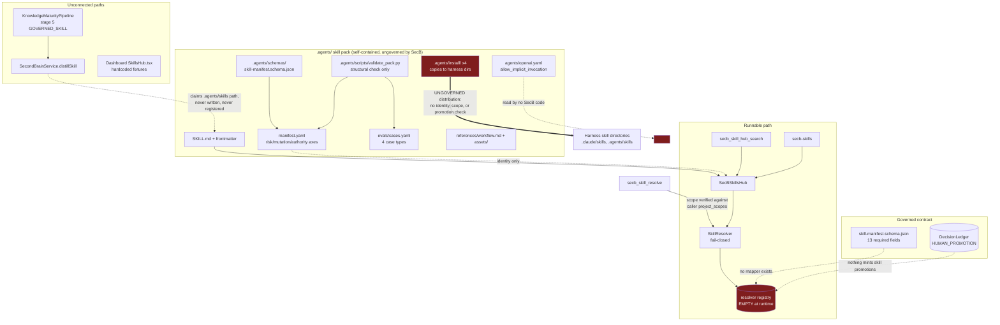

# SecB SkillsHub — Skill Intake, Evaluation, Promotion and Distribution — Product Requirements Document

## Document control

| Field | Value |
|---|---|
| Document ID | `SECB-PRD-SKILLSHUB-001` |
| Version | `0.3.0-draft` |
| Status | `DRAFT / NOT EFFECTIVE` |
| Product | SecB SkillsHub (`MOD-SKILL`) |
| Product owner | Unassigned — operator to appoint |
| Architecture owner | Unassigned — operator to appoint |
| Producer | Claude Code research session (worker agent, no approval authority) |
| Produced at | 2026-08-01 |
| Repository | `C:\laragon\www\SecB` |
| Branch | `feat/secb-ruflo-command-center` |
| Observation baseline | `e0de4f30589076ad120cf74b11c75da0382e173c` — all §7 source observations were taken at this commit |
| Baseline condition | **Dirty and moving.** `HEAD` has since advanced (concurrent MCP work by another producer), and the tree carries this document plus its own index registration in `MANIFEST.json`, `docs/MANIFEST.json`, and `docs/README.md`. §7 observations are baseline-accurate but stale relative to `HEAD`; a REV dispatch must re-pin |
| Risk classification | Candidate `R3` — skills alter agent behaviour, tool use, and evidence production across every harness |
| Mutation classification | This document is `M1` planning only. Per-work-package risk and mutation classes are **required** by [`05-work-package-lifecycle.md`](../../12-execution/05-work-package-lifecycle.md) and are recorded in §15; the earlier blanket `M2` understated `WP-SK-05` and `WP-SK-06` |
| Required review | Independent `REV` and `QA` are owed **on this document now**, not deferred: [`docs/AGENTS.md`](../../AGENTS.md) attaches the requirement to documentation that changes skill promotion, and `R3` adds `SEC` and human `GOV` |

### Authority statement

This PRD is a product and implementation candidate produced by a worker agent.
It does not:

- make the Phase 0 documentation pack or [`SECB-SKILL-001`](../../07-capabilities/skillshub-lifecycle.md) effective;
- publish, promote, approve, activate, or authorize any skill;
- accept any package under `.agents/skills/` as governed or consumable;
- authorize intake of an external skill corpus;
- accept producer tests or this document as final evidence; or
- authorize merge to `main`, deployment, or production use.

Controlling boundaries remain the repository [`AGENTS.md`](../../../AGENTS.md),
[`docs/AGENTS.md`](../../AGENTS.md), and the effective baseline identified by the
[documentation index](../../README.md). Skill publication authority is defined by
[`decision-rights.md`](../../00-governance/decision-rights.md) and is not held by
any agent, including the producer of this document.

---

## 1. Executive summary

SecB is designated as the system of record for "Skills and versions"
([`system-of-record-boundaries.md`](../../00-governance/system-of-record-boundaries.md)),
and `MOD-SKILL` is scoped as "Skill intake, evaluation, promotion and
distribution" at High priority
([`03-module-catalog.md`](../../10-platform/03-module-catalog.md)).

The current state is unusual and worth stating plainly: **SecB has a complete
skill doctrine, a correct fail-closed resolver, and 22 structurally complete
skill packages — and almost nothing connecting them.**

What exists and is sound:

- a twelve-stage lifecycle and a twelve-item publication gate list
  ([`SECB-SKILL-001`](../../07-capabilities/skillshub-lifecycle.md));
- a closed governed manifest contract with 13 required fields, 8 lifecycle
  states, and 7 decision types
  ([`skill-manifest.schema.json`](../../../contracts/skill-manifest.schema.json));
- a fail-closed `SkillResolver` that requires a ledger-resolved
  `HUMAN_PROMOTION` decision for publication and emits 7 typed resolution-time
  deny codes ([`skill-resolver.mjs`](../../../src/registry/skill-resolver.mjs));
- 22 skill packages carrying a package manifest, a cross-harness agent binding,
  a four-type evaluation suite, an output template, and reference workflows;
- a self-contained **skill pack** under [`.agents/`](../../../.agents/) with its
  own closed manifest schema, a structural validator, four harness installers,
  a 162-entry digest manifest, and an upstream source-traceability record;
- a discovery and authorization surface reachable over MCP as
  `secb_skill_hub_search`, plus a second tool, `secb_skill_resolve`.

What does not exist:

- **no mapping** between the pack's manifest schema and the governed contract —
  they describe different things on different axes, so no package can be
  registered with the resolver as written;
- **no executing evaluation runner** — the pack's validator checks that the
  case files are *present and well-formed*, but nothing *runs* the cases, so
  the publication gate "skill-enabled evaluation passes" cannot be satisfied by
  evidence;
- **no promotion path** — nothing mints the `HUMAN_PROMOTION` governance
  decision the resolver demands, so `CANDIDATE → PUBLISHED` is unreachable;
- **no distribution or revocation service** bound to the governed contract, and
  no consumption telemetry. The pack's installers copy files; they do not
  resolve authority.

The consequence, made visible at the stated baseline by the fail-closed fix in
commit `e0de4f3`, is that **zero skills are consumable through SecB**. This is
the correct governed outcome, not a regression: prior to that commit the
authorization gate recognized only two deny shapes and read the other six typed
denials — including `DENY_UNKNOWN_SKILL` and `DENY_NOT_PUBLISHED` — as allows,
and skipped the check entirely when no resolver was wired.

The product priority is therefore **closing the loop between the packages that
already exist and the governance that already exists** — a promotion pipeline,
not more skill content and not a second registry.

---

## 2. Product problem

### 2.1 User problem

An operator running Codex, Claude Code, and other harnesses currently has no
trustworthy way to:

- know which skills an agent is actually permitted to load, and why;
- promote a demonstrably useful technique into a reusable skill without
  hand-editing files that nothing validates;
- prove a skill was evaluated before it changed agent behaviour;
- see which skill version an agent used when producing a given artifact;
- restrict a skill to a project, role, or data class;
- withdraw a skill from circulation without editing every harness; or
- distinguish a governed skill from a directory someone dropped into
  `.agents/skills/`.

### 2.2 Governance problem

A skill is a behaviour change delivered as data. It instructs an agent on
method, tool use, and what counts as done. An unevaluated skill is therefore an
unreviewed change to every agent that loads it, with none of the controls
applied to code.

[`02-evidence-knowledge-skill.md`](../../15-knowledge/02-evidence-knowledge-skill.md)
prohibits "skill publication based only on author demonstration" and states that
a skill may not grant execution authority.
[`superpowers-intake.md`](../../07-capabilities/superpowers-intake.md) requires
adapters that "prohibit automatic skill discovery from bypassing SkillsHub
approval". Both are currently unenforced by any running code.

### 2.3 Technical problem

The SkillsHub has two disconnected halves and one contradictory third path.

- **Discovery half** — `SecBSkillsHub`
  ([`skills-hub-service.mjs`](../../../src/skills/skills-hub-service.mjs))
  indexes `.agents/skills/*/SKILL.md`, parses frontmatter and `manifest.yaml`,
  and gates every read on the resolver.
- **Authorization half** — `SkillResolver` enforces the
  [`SECB-SKILL-001`](../../07-capabilities/skillshub-lifecycle.md) distribution
  rule correctly, but its registry is populated by nothing at runtime.
- **Contradictory third path** — `KnowledgeMaturityPipeline.promoteExperienceToSkill`
  ([`knowledge-maturity-pipeline.mjs`](../../../src/brain/knowledge-maturity-pipeline.mjs))
  advances a pipeline to a stage literally named `GOVERNED_SKILL` and returns a
  package asserting the path `.agents/skills/<name>/SKILL.md`, with no
  evaluation, no security review, no independent REV/QA, no promotion decision,
  and no resolver registration.

Building a second skill registry, or letting the maturity pipeline write into
`.agents/skills/`, would deepen this drift. The product must converge these
paths onto the governed contract.

---

## 3. Product vision

SecB SkillsHub is the local-first, harness-neutral registry through which a
technique becomes a governed, versioned, revocable capability:

1. a skill package is **authored or imported** as an immutable, pinned source;
2. intake **maps** it to one governed manifest contract or rejects it;
3. **evaluation runs** produce evidence — baseline failure, skill-enabled pass,
   adversarial resistance, and cross-harness behaviour;
4. **security and supply-chain review** is a separate, independent verdict;
5. **human promotion** is an explicit governed decision recorded in the ledger;
6. **distribution** narrows to the requesting agent's project, role, runtime,
   Work Package, environment, and data class;
7. **consumption is attributable** — every skill load is an event bound to the
   agent, session, and version;
8. **revocation is immediate** and does not require editing any harness; and
9. the Command Center shows this state as a projection of authoritative records,
   never as decoration.

---

## 4. Objectives and measurable outcomes

| ID | Objective | Product outcome |
|---|---|---|
| `OBJ-SK-01` | One skill identity | Every governed skill has exactly one manifest, one version series, and one lifecycle state |
| `OBJ-SK-02` | Reachable promotion | A skill can travel `CANDIDATE → PUBLISHED` entirely through governed, evidence-producing steps |
| `OBJ-SK-03` | Evidence-backed publication | No skill is publishable without executed evaluation evidence, not an author's assertion |
| `OBJ-SK-04` | Scoped distribution | An agent receives only versions authorized for its full asserted context |
| `OBJ-SK-05` | Attributable consumption | Every skill load is a durable event naming agent, session, project, and version |
| `OBJ-SK-06` | Immediate revocation | An authorized revocation blocks the next resolution without harness reconfiguration |
| `OBJ-SK-07` | No self-promotion | No agent, pipeline, or automated stage can publish a skill or accept its own evaluation |
| `OBJ-SK-08` | Honest surfaces | CLI, MCP, and UI report authorized, withheld, and unavailable states distinctly; none presents fixtures as fact |
| `OBJ-SK-09` | Controlled intake | External skill corpora enter through a pinned, licence-reviewed, security-scanned path |

### 4.1 MVP success criteria

The MVP succeeds when all of the following are independently verified:

1. Every one of the 22 manifest-carrying packages either maps cleanly to the
   governed contract or produces a typed, actionable intake rejection.
2. One low-risk skill completes the full path from package to `PUBLISHED`,
   satisfying the roadmap Phase 5 exit criterion recorded in
   [`implementation-roadmap.md`](../../09-delivery/implementation-roadmap.md).
3. The evaluation runner executes that skill's `evals/cases.yaml` and produces
   evidence envelopes for positive, negative, adversarial, and boundary cases.
4. A baseline-failure result exists showing the task was not already solved
   without the skill.
5. Promotion is refused when evaluation evidence is missing, stale, or bound to
   a different version.
6. Promotion is refused when the reviewer, QA verifier, or approver is the
   producer.
7. An agent outside the skill's project, role, runtime, or data-class scope
   receives a typed deny and no content.
8. Revoking the published skill causes the next resolution to deny, with no
   process restart and no harness edit.
9. Every resolution — allow and deny — appears as a durable, attributable event.
10. The Command Center SkillsHub view contains no record not derived from an
    authoritative store.
11. `secb_skill_hub_search` returns identical authorization outcomes to the CLI
    and the UI for the same asserted context.

---

## 5. Stakeholders and decision rights

Derived from [`decision-rights.md`](../../00-governance/decision-rights.md),
whose skill-publication row reads: propose `SKILL`, execute `SkillsHub operator`,
verify `QA/SEC`, approve `Human or delegated skill authority`.

| Stakeholder / role | Need | Decision right |
|---|---|---|
| Operator | Inspect, run evaluations, publish approved skills, revoke | Local operational execution within granted scope |
| Human GOV / skill authority | Control what agents are taught | **Final approval for publication and revocation** |
| SKILL / DOMAIN | Identify candidate techniques and required capabilities | Proposal only |
| ARCHI | Own manifest contract, lifecycle, and distribution model | Architecture candidate production |
| ENGIN | Implement intake, runner, promotion, distribution services | Producer only |
| REV | Independently challenge skill content, claims, and evaluation design | Independent review verdict |
| QA | Execute evaluation and adversarial verification | Acceptance verification |
| Evidence authority | Accept or refuse evaluation runs as evidence in the SecB Evidence Ledger | **Evidence acceptance** — per [`decision-rights.md`](../../00-governance/decision-rights.md); the producer may submit but never accept |
| SEC | Review supply chain, licence, injection surface, secret handling | Security verdict |
| KNOW / Hippocampus | Supply accepted evidence and knowledge claims upstream of candidacy | Knowledge admission only |
| Harness adapters (Codex, Claude Code, Ruflo) | Consume authorized skills, emit attributable events | **No authority issuance, no self-promotion** |
| Upstream skill source | Maintain upstream identity, version, licence | Upstream responsibility only |

Separation of duties (mandatory): the producer of a skill may not be its
reviewer, its QA verifier, or its approver. An agent may not accept its own
evaluation evidence.

---

## 6. Scope

### 6.1 In scope

- governed skill manifest convergence and a package-to-contract intake mapper;
- skill package structure standard (`SKILL.md`, `manifest.yaml`, `agents/`,
  `evals/`, `references/`);
- deterministic evaluation runner over `evals/cases.yaml` with baseline,
  skill-enabled, adversarial, and boundary modes;
- security and supply-chain review checkpoints (licence, source pin, secret
  scan, dependency scan, injection surface);
- promotion service binding evaluation evidence to a governed decision;
- distribution/resolution service extending the current resolver to the full
  doctrinal scope set;
- revocation, deprecation, and quarantine lifecycle;
- consumption events and skill-attributed outcome monitoring;
- CLI (`secb skills ...`) and MCP surfaces for search, inspect, evaluate,
  propose, and status;
- read-only Command Center SkillsHub view;
- controlled intake path for external corpora, per
  [`superpowers-intake.md`](../../07-capabilities/superpowers-intake.md).

### 6.2 Permanently prohibited — not scoping choices

These do not return in a later phase. Each is forbidden by a controlling
document, and only the cited authority can change that.

- **automatic promotion of any kind**, including from the Knowledge Maturity
  Pipeline — [`02-evidence-knowledge-skill.md`](../../15-knowledge/02-evidence-knowledge-skill.md)
  prohibits transcript-to-knowledge automatic promotion;
- **agent-authored skills entering circulation without human promotion** —
  [`decision-rights.md`](../../00-governance/decision-rights.md) reserves
  approval to a human or delegated skill authority;
- **skills granting execution, approval, or authority escalation** —
  [`02-evidence-knowledge-skill.md`](../../15-knowledge/02-evidence-knowledge-skill.md):
  a skill may not grant execution authority;
- **skill publication based only on author demonstration** — same source.

### 6.3 Out of scope for MVP

- skill marketplace or publication to a public registry (external publication
  authority is not granted; remote publication is a retained hard gate under
  [`AGENTS.md`](../../../AGENTS.md), so this is gated, not merely deferred);
- LLM-judged evaluation as the sole acceptance signal;
- skills that carry executable code with unrestricted privileges;
- replacing Git as the source of truth for package content.

### 6.4 Future-compatible but deferred

- remote/federated skill distribution across hosts (**gated**, not open — see
  §6.3);
- skill dependency graphs and composition;
- per-skill cost/latency budgets enforced at load time (measurement is
  `FR-SKE-011` MUST; *enforcement* at load time is the deferred part);
- A2A skill delegation — deferred under a **default-deny** framing, since a
  skill may not grant execution authority and an A2A boundary must not become
  the exception.

Upstream drift monitoring is **not** deferred: it is a terminal stage of the
intake lifecycle in [`superpowers-intake.md`](../../07-capabilities/superpowers-intake.md)
and is carried as `FR-SKC-007`.

---

## 7. Current-state discovery

All observations verified at baseline `e0de4f3` on 2026-08-01.

### 7.1 Inventory

| Area | Observed |
|---|---|
| Skill packages | 25 directories under `.agents/skills/` |
| Structurally complete | 22 carry `manifest.yaml`, `agents/openai.yaml`, `evals/cases.yaml`, `references/workflow.md`, and `assets/output-template.md` |
| Bare packages | 3 carry only `SKILL.md`: `graphify`, `secb-project-registry`, `worktree` |
| Package frontmatter | 25/25 have valid `name` + `description` YAML frontmatter |
| Evaluation corpus | 22 `evals/cases.yaml` files, 684 lines total, 4 case types each (`positive`, `negative`, `adversarial`, `boundary`) |
| Harness bindings | 22 `agents/openai.yaml` files declaring display name, default prompt, and an invocation policy |
| Governed contract | [`skill-manifest.schema.json`](../../../contracts/skill-manifest.schema.json) — closed, 13 required fields, 8 status values, 7 decision types |
| Pack manifest schema | [`.agents/schemas/skill-manifest.schema.json`](../../../.agents/schemas/skill-manifest.schema.json) — closed, 10 required fields, **lowercase** status enum; this is the schema the 22 packages actually conform to |
| Authoring template | [`docs/templates/skill-manifest.yaml`](../../templates/skill-manifest.yaml) — nested under a `skill:` key, carrying 9 fields the governed contract does not define (8 under `skill:` plus top-level `schema_version`); used by 0 of 25 packages |
| Pack validator | [`.agents/scripts/validate_pack.py`](../../../.agents/scripts/validate_pack.py) — reads every `SKILL.md`, `manifest.yaml`, and `evals/cases.yaml`; asserts the four case types are present; enforces `mutation_class == M0` and `controls.secret_handling == prohibited`; runs a repo-wide secret scan |
| Pack provenance | [`.agents/PACK.yaml`](../../../.agents/PACK.yaml) (`SECB-ARCH-SKILLS-PACK-001`, `status: candidate`, `effective: false`, `mutation_authorized: false`), `.agents/MANIFEST.sha256` (162 digests), `.agents/CHANGELOG.md`, [`source-traceability.md`](../../../.agents/docs/source-traceability.md) (15 pinned upstream sources) |
| Pack installers | [`.agents/install/`](../../../.agents/install/) — `install-codex.{sh,ps1}` copy packages to `<target>/.agents/skills`; `install-claude.{sh,ps1}` copy to `<target>/.claude/skills`; both refuse to overwrite |
| Resolver | [`skill-resolver.mjs`](../../../src/registry/skill-resolver.mjs) — fail-closed; **7** distinct resolution-time deny codes, plus 3 registration-time error codes |
| Discovery service | [`skills-hub-service.mjs`](../../../src/skills/skills-hub-service.mjs) — indexes packages, gates all reads on the resolver |
| MCP surface | **Two** tools, `secb_skill_hub_search` and `secb_skill_resolve`. Both require `project_id`, screen it as an identity param, verify it against the caller identity's own `project_scopes` before dispatch (`DENY_CALLER_PROJECT_SCOPE`), and derive runtime and classification from the resolved caller. See `SKILL-FIX-07` |
| CLI surface | `secb-skills` binary; search only |
| UI surface | [`SkillsHub.tsx`](../../../dashboard/src/pages/SkillsHub.tsx) — 6 hardcoded skills; 1 (`graphify`) is a real package, the other 5 are not |
| YAML tooling | No YAML dependency in `package.json`; a minimal top-level scalar parser is embedded in the hub service. The pack validator is Python and uses `yaml` |
| Executing eval runner | None. The pack validator checks case files structurally; nothing executes a case |
| Distribution machinery | Four file-copy installers in `.agents/install/`. No authority-resolving distribution service in `src/` or `tools/` |

### 7.2 Observed component relationships

### 7.3 Documented versus observed

| ID | Documented expectation | Observed implementation | Classification |
|---|---|---|---|
| `SKILL-DRIFT-01` | One skill manifest | **Four** shapes exist, two of them independently enforced. (a) Package `manifest.yaml`, validated by the closed [`.agents/schemas/skill-manifest.schema.json`](../../../.agents/schemas/skill-manifest.schema.json) (10 required fields, lowercase status enum). (b) The governed [`contracts/skill-manifest.schema.json`](../../../contracts/skill-manifest.schema.json) (13 required fields, uppercase status enum, closed). (c) The authoring template, nested under `skill:`. (d) The `secb_skill_resolve` MCP argument shape. **The two closed schemas share no required field beyond `skill_id`, `name`, `version`, and `status`** | **Contradiction** — two enforced schemas for one concept; a package valid under one is invalid under the other |
| `SKILL-DRIFT-02` | Publication requires "skill-enabled evaluation passes" | 22 evaluation suites exist and [`validate_pack.py`](../../../.agents/scripts/validate_pack.py) **does** read them — but only structurally, asserting the four case types are declared. Nothing executes a case against a harness, so no run, no result, and no evidence exists | **Gap** — the gate has a *conformance* mechanism but no *execution* mechanism |
| `SKILL-DRIFT-03` | Distribution is scoped to "Agent Instance, role, project, Work Package, environment, data class, and runtime" ([`SECB-SKILL-001`](../../07-capabilities/skillshub-lifecycle.md)) | Contract and resolver cover project, runtime, and data class only; role, Work Package, environment, and Agent Instance are absent from both | **Gap** — doctrine exceeds contract by four dimensions |
| `SKILL-DRIFT-04` | "Prohibit automatic skill discovery from bypassing SkillsHub approval" ([`superpowers-intake.md`](../../07-capabilities/superpowers-intake.md)) | 22 packages ship `agents/openai.yaml` with `policy.allow_implicit_invocation: true` | **Contradiction** — packages declare the behaviour the intake doctrine forbids |
| `SKILL-DRIFT-05` | "Skill publication based only on author demonstration" is prohibited ([`02-evidence-knowledge-skill.md`](../../15-knowledge/02-evidence-knowledge-skill.md)) | `promoteExperienceToSkill` advances to a stage named `GOVERNED_SKILL` and emits a package claiming a `.agents/skills/` path, with no evaluation, review, decision, or registration | **Contradiction** — naming asserts governance the code does not perform |
| `SKILL-DRIFT-06` | Tool declarations are accurate | `secb_brain_maturity_promote` is described as advancing pipeline stages; its dispatch calls `getPipelineStatus` only | **Documentation drift** — the handler is genuinely read-only; the name and description overstate it |
| `SKILL-DRIFT-07` | The UI is a projection of authoritative records | `SkillsHub.tsx` hardcodes 6 skills — 1 (`graphify`) is a real package, 5 are not — with invented `tokensSaved` values, a constant "95.4% Saved", and a `setTimeout` "Sync to Local Agent Tools" control. Real installers **do** exist in [`.agents/install/`](../../../.agents/install/), but the button is not wired to them and they perform an ungoverned file copy, not an authorized distribution | **Contradiction** — the control simulates a capability that exists in an ungoverned form elsewhere |
| `SKILL-DRIFT-08` | Revocation is part of the lifecycle | The resolver detects a `REVOCATION` entry in a manifest's approval history; no revocation service, no re-validation at resolution time, and a source comment defers this to an open lifecycle item | **Partial implementation** |
| `SKILL-DRIFT-09` | Every governed object has an identity | 3 of 25 packages have no `skill_id` or version at all | **Gap** — they resolve to `DENY_UNGOVERNED_PACKAGE` by design |
| `SKILL-DRIFT-10` | Lifecycle vocabulary is shared | Package manifests use lowercase `status: candidate`; the governed contract enum is uppercase `CANDIDATE`. The lowercase form is **schema-conformant** under the pack schema, whose enum is `draft\|candidate\|evaluated\|restricted-pilot\|approved\|published\|deprecated\|revoked\|quarantined` — a 9-value set against the contract's 8, differing in membership as well as case (`draft`, `evaluated`, `restricted-pilot`, `approved` versus `SANDBOX`, `EVALUATION`, `REVIEW`) | **Contradiction** — two governed lifecycle vocabularies, not a casing slip |
| `SKILL-DRIFT-11` | Promotion is reachable | The resolver requires each claimed `HUMAN_PROMOTION` to resolve in the DecisionLedger as a `GOVERNANCE` decision; nothing in the repository mints such a decision for a skill | **Gap** — `PUBLISHED` is currently unreachable by construction |
| `SKILL-DRIFT-12` | The authoring template produces a valid manifest | [`docs/templates/skill-manifest.yaml`](../../templates/skill-manifest.yaml) declares 21 fields under a `skill:` key plus a top-level `schema_version`. The governed contract's field set is a **strict subset** of the template's: every one of the contract's 13 properties is present in the template, and the contract defines none the template lacks. The 9 fields the template has and the contract does not are `input_schema`, `output_schema`, `required_models`, `required_tools`, `required_mcp_methods`, `tests`, `evaluations`, `known_limitations`, and `schema_version`. Because the contract is flat and closed, the template fails validation as written. No package uses it. *(The subset relation is verified; the direction of derivation is not — no ADR, commit message, or comment records which came first.)* | **Contradiction** — a richer declared intent and a narrower enforced contract coexist with no recorded decision reconciling them |
| `SKILL-DRIFT-13` | Capability requirements are declared | The template's `required_models`, `required_tools`, and `required_mcp_methods` express the model/tool/MCP dependencies that [`SECB-SKILL-001`](../../07-capabilities/skillshub-lifecycle.md) names as part of a skill package; the enforced contract drops all three | **Gap** — a skill cannot currently declare what it needs to run |
| ~~`SKILL-DRIFT-14`~~ | The agent does not choose its own effective scope | **WITHDRAWN — the finding was already closed when this document first asserted it.** `secb_skill_resolve` did dispatch as `resolveSkill(args.skill_id, args.version, args.context ?? {})` at `e0de4f3`, making the whole scope caller-supplied. The MCP producer fixed it in `42c2190`, 56 minutes before this document was committed, and this document's producer did not re-verify against `HEAD` before publishing. See `SKILL-FIX-07` | **Producer error** — a stale observation published as a live finding |
| `SKILL-DRIFT-15` | Distribution is authorized | The four [`.agents/install/`](../../../.agents/install/) scripts copy every package into a harness skills directory with no identity, scope, classification, promotion, or revocation check. They are the operative distribution path today, and they bypass the SkillsHub entirely — the outcome [`superpowers-intake.md`](../../07-capabilities/superpowers-intake.md) requires adapters to prevent | **Contradiction** — an ungoverned distribution channel exists and works |

### 7.4 Producer-asserted dispositions, pending independent verification

These are **producer claims, not accepted evidence.** The producer of this
document also authored commit `e0de4f3`. Per [`docs/AGENTS.md`](../../AGENTS.md),
a control may not be stated as implemented or conformant without accepted
evidence, and none of the below has been independently accepted. §22 routes both
this section and §7.3 to REV.

| ID | Finding | Disposition |
|---|---|---|
| `SKILL-FIX-01` | The hub's authorization gate recognized only `verdict === "DENY"` and `DENY_POLICY_CEILING`, reading six other typed denials as allows, and skipped the check entirely when no resolver was wired | Producer asserts fixed in `e0de4f3`; gate allow-lists the single `ALLOW` code. Regression pins 8 codes — the resolver's 7 plus the legacy hub-level `DENY_POLICY_CEILING`, which the resolver never emits |
| `SKILL-FIX-02` | The indexer read `SKILL.md` line 1 as the title, yielding `---` for all 25 packages and leaking frontmatter into token-budgeted snippets | Fixed in `e0de4f3` |
| `SKILL-FIX-03` | Resolution used a hardcoded version `"1.0.0"` and a hardcoded `projectId` | Fixed in `e0de4f3`; identity now comes from `manifest.yaml`, context from the caller |
| `SKILL-FIX-04` | `seedDefaultSkills()` fabricated five in-memory skills with no provenance | Removed in `e0de4f3` |
| `SKILL-FIX-05` | The `secb_skill_hub_search` tool passed no governed context | Producer asserts fixed in `e0de4f3`; `project_id` is a required, delimiter-screened argument, runtime is taken from the resolved caller identity, and the ceiling remains server-derived. At the time this was written it fixed one of the two skill tools; `42c2190` subsequently closed the other and added a caller-project-scope check covering both — see `SKILL-FIX-07` |
| `SKILL-FIX-06` | The `withheld_count`/`withheld_reasons` aggregate introduced by `e0de4f3` was computed over the query-matched subset, making it a query-conditioned existence oracle: an unauthorized caller probing `"graphify"` read back a count of 1, and iterating the query space recovered the withheld corpus by name | Producer asserts fixed after this document's first independent review; authorization now runs over the whole index and the query narrows only authorized results, so the tally is constant for a given caller context. **Requires a SEC verdict** — the disclosure design itself has not been reviewed, only this leak closed |
| `SKILL-FIX-07` | `secb_skill_resolve` accepted a fully caller-supplied scope context, so a caller bound to project A could assert project B — an authorization bypass by construction | **Closed by the MCP producer in `42c2190`, independently of this document.** `context` was removed from the tool's arguments in favour of a required `project_id`; runtime is taken from `callerIdentity.runtime_product_id` and classification from the server-derived ceiling. The fix goes further than the sibling path did: a new `DENY_CALLER_PROJECT_SCOPE` check verifies `args.project_id` against the caller identity's own `project_scopes` **before dispatch, for both skill tools**, so the caller cannot name a project it is not authorized for. Covered by [`tests/mcp-server.test.mjs`](../../../tests/mcp-server.test.mjs). Verified by this document's producer at `HEAD`; still owed independent REV |

### 7.5 Evidence and uncertainty register

| Claim | Evidence | Status / limitation |
|---|---|---|
| SecB is the system of record for skills | [`system-of-record-boundaries.md`](../../00-governance/system-of-record-boundaries.md) | Verified document state |
| `MOD-SKILL` is High priority, intake/eval/promotion missing | [`03-module-catalog.md`](../../10-platform/03-module-catalog.md), [`module-completion-tracker-001.md`](module-completion-tracker-001.md) | Verified document state |
| Publication requires human promotion and independent review | [`SECB-SKILL-001`](../../07-capabilities/skillshub-lifecycle.md), [`decision-rights.md`](../../00-governance/decision-rights.md) | Verified document state |
| Phase 5 exit is one published low-risk skill | [`implementation-roadmap.md`](../../09-delivery/implementation-roadmap.md) | Verified document state |
| Manifest shapes diverge | Direct comparison of the two closed schemas: their required-field sets intersect in exactly `skill_id`, `name`, `version`, `status` | Verified source observation |
| ~~No code reads `evals/` or `agents/*.yaml`~~ | — | **RETRACTED.** [`validate_pack.py`](../../../.agents/scripts/validate_pack.py) reads both. The original search covered only `src/`, `tools/`, and `tests/` and did not open `.agents/` itself. The surviving claim is that no code *executes* a case |
| ~~No distribution/sync machinery exists~~ | — | **RETRACTED.** Four installers exist in [`.agents/install/`](../../../.agents/install/); same scoping error. See `SKILL-DRIFT-15` |
| ~~No provenance record exists for the 22 packages~~ | — | **RETRACTED.** `.agents/PACK.yaml`, `.agents/MANIFEST.sha256` (162 digests), `.agents/CHANGELOG.md`, and [`source-traceability.md`](../../../.agents/docs/source-traceability.md) (15 pinned upstream sources) constitute a provenance chain; same scoping error |
| Maturity pipeline emits an ungoverned "governed skill" | [`knowledge-maturity-pipeline.mjs`](../../../src/brain/knowledge-maturity-pipeline.mjs), [`second-brain-service.mjs`](../../../src/brain/second-brain-service.mjs) | Verified source observation; **not** MCP-reachable — the dispatch exposes status reads only |
| Fail-closed behaviour holds at this baseline | 905 tests, 899 pass, 0 fail, 6 pre-existing `BLOCKED` skips — **this run excluded `tests/mcp-hub-launcher.test.mjs`**, which is the source of the separate failure below. The earlier presentation of these two rows was internally contradictory: 899 + 6 = 905 leaves no slot for a failure | Producer-run check; **not** independent acceptance. Stale relative to `HEAD` |
| One launcher test fails on this host | `ps: unknown option -- o` under Git Bash on Windows, in a test that only spawns child processes | Environment gap unrelated to SkillsHub; not verified against a pristine baseline |
| Cross-harness skill behaviour | Manifests declare `cross_harness: [codex, claude-code, generic-agent-skills]` | **Unverified** — declared intent, never executed |
| Token-efficiency claims | Dashboard displays fabricated values | **Unverified and currently fabricated**; no measurement exists |

---

## 8. Target architecture

### 8.1 Target pipeline

```mermaid
flowchart LR
    Src[Pinned package source] --> Intake[Intake and Mapping Service]
    Intake -->|typed rejection| Rej[Intake Findings]
    Intake --> Cand[Governed manifest CANDIDATE]
    Cand --> Sandbox[Sandbox Execution]
    Sandbox --> Runner[Evaluation Runner]
    Runner --> Base[Baseline-failure evidence]
    Runner --> Enabled[Skill-enabled evidence]
    Runner --> Adv[Adversarial and boundary evidence]
    Base --> Pack[Evidence Envelopes]
    Enabled --> Pack
    Adv --> Pack
    Pack --> Sec[Security and supply-chain review]
    Sec --> Rev[Independent REV and QA]
    Rev --> Promo[Promotion Service]
    Promo -->|mints| Dec[(DecisionLedger<br/>GOVERNANCE / HUMAN_PROMOTION)]
    Dec --> Resolver[SkillResolver registry]
    Resolver --> Hub[SecBSkillsHub]
    Hub --> Agents[Authorized agents]
    Agents --> Events[(Consumption events)]
    Events --> Monitor[Outcome monitoring]
    Monitor -->|drift, failure, incident| Revoke[Revocation / Quarantine]
    Revoke --> Resolver
```

### 8.2 Architectural principles

1. **One manifest.** The governed contract is authoritative. A package manifest
   is an intake input that is mapped and validated, never a parallel authority.
2. **Evidence precedes publication.** Promotion consumes executed evaluation
   evidence bound to the exact version; an author's assertion is not evidence.
3. **Promotion is a decision, not a state write.** `PUBLISHED` exists only where
   a governance decision resolves in the ledger.
4. **Separation of duties is structural.** The service refuses a promotion whose
   reviewer, verifier, or approver is the producer.
5. **Distribution narrows only.** No package field, harness binding, or caller
   argument can widen the scope a promotion granted.
6. **Discovery is not consumption.** Listing metadata and loading content are
   separately authorized.
7. **Skill content is untrusted input.** A skill's text may instruct an agent's
   method; it may never assert authority, approval, or evidence acceptance.
8. **No implicit invocation.** A skill is loaded because policy authorized it,
   never because a package declared itself auto-invocable.
9. **Revocation is immediate and central.** One decision blocks the next
   resolution everywhere; no harness edit, no restart.
10. **The UI is a projection.** Absent data is displayed as absent.

---

## 9. Canonical domain model

| Entity | Purpose | Authoritative relationship |
|---|---|---|
| Skill Package | Immutable authored/imported source tree | Pinned by repository path plus content digest |
| Skill Manifest | The governed record for one version | One per `skill_id@version`; conforms to the closed contract |
| Intake Record | Result of mapping a package to the contract | Produces a candidate manifest or typed findings |
| Evaluation Suite | Declared cases for a version | Belongs to the package; versioned with it |
| Evaluation Run | One executed suite against one version, harness, and model | Produces evidence envelopes; never self-accepted |
| Review Verdict | Independent REV, QA, or SEC outcome | Bound to version, run, and reviewer identity |
| Promotion Decision | Governed `HUMAN_PROMOTION` record | Resolves in the DecisionLedger; the sole basis for `PUBLISHED` |
| Distribution Grant | Effective scope for a published version | Intersects agent, role, project, Work Package, environment, runtime, data class |
| Resolution Event | One authorization outcome | Records allow or typed deny with full context |
| Consumption Event | One skill load by an agent | Binds agent, session, project, version |
| Revocation Record | Withdrawal of a version | Terminal for that version; blocks the next resolution |

### 9.1 Manifest convergence requirement

Four shapes must converge to one: the pack schema that the 22 packages actually
validate against, the governed contract, the authoring template, and the
`secb_skill_resolve` argument shape. Two of the four are independently enforced
closed schemas whose required-field sets intersect only in `skill_id`, `name`,
`version`, and `status`:

| Package `manifest.yaml` field | Governed contract counterpart | Action required |
|---|---|---|
| `skill_id`, `name`, `version` | `skill_id`, `name`, `version` | Direct — normalize case and pattern |
| `status: candidate` | `status: CANDIDATE` | Normalize vocabulary |
| `classification.risk_class` (`R0..R4`) | *none* | **Decide**: extend contract or map to a review requirement |
| `classification.mutation_class` (`M0..M2`) | *none* | **Decide**: extend contract or map to a control |
| `classification.authority_ceiling` (`A0..A5`) | *none* | **Decide**: relate to [`decision-rights.md`](../../00-governance/decision-rights.md) authority classes |
| `roles.allowed`, `roles.prohibited_final_authority` | *none* | **Extend** — required by the doctrinal role dimension (`SKILL-DRIFT-03`) |
| `inputs.required`, `outputs.required` | *none* | **Decide**: contract field or evaluation input |
| `controls.*` (repository mutation, external facts, secrets, approval claims) | *none* | **Extend** — these are the enforceable safety properties |
| `evaluation.suite`, `evaluation.cross_harness` | *none* (`evidence_refs` holds results) | **Extend** — declare the suite; bind runs to `evidence_refs` |
| *none* | `owner`, `source{repository,commit_sha,licence}`, `purpose` | **Supply at intake** — must not be fabricated |
| *none* | `project_scopes`, `supported_runtimes`, `max_data_classification` | **Supply at promotion** — these are grants, not self-declarations |
| *none* | `evidence_refs`, `approval_history`, `revocation_conditions` | **Produced by the pipeline**, never authored by hand |

Fields present only in the authoring template, absent from both the package
corpus and the enforced contract:

| Template field | Significance | Action required |
|---|---|---|
| `input_schema`, `output_schema` | The publication gate "input/output contracts validate" ([`SECB-SKILL-001`](../../07-capabilities/skillshub-lifecycle.md)) has no field to validate against | **Extend** — the gate is unenforceable without them |
| `required_models`, `required_tools`, `required_mcp_methods` | A skill's runtime dependencies; also the basis for least-privilege tool grants | **Extend** (`SKILL-DRIFT-13`) |
| `tests`, `evaluations` | Declared suites, distinct from executed results in `evidence_refs` | **Extend** — resolves the declare-versus-result conflation |
| `known_limitations` | Required for honest consumption and for the boundary-case contract | **Extend** |
| `schema_version` | Contract versioning | **Decide** — envelope field or contract property |
| Nesting under `skill:` | Incompatible with the flat closed contract | **Decide** — flatten the template, or add an envelope to the contract |

Two rules govern the convergence. First, fields an author may **declare** and
fields a promotion may **grant** must not live in the same trust tier — nothing
in the granted set may be populated from package content. Second, a **declared**
suite is not an **executed** result; `tests`/`evaluations` and `evidence_refs`
must remain separate fields.

---

## 10. Primary user journeys

### `UJ-SK-01` Intake a package

1. Operator runs intake against a pinned package path and commit.
2. Service computes a content digest and records the source pin.
3. Mapper produces a candidate governed manifest or typed findings.
4. Licence, secret scan, and dependency scan run.
5. Candidate is recorded as `CANDIDATE`; nothing is consumable.

### `UJ-SK-02` Evaluate a candidate

1. Operator runs the suite for a version against declared harnesses.
2. Baseline mode runs each positive case **without** the skill.
3. Skill-enabled mode runs the same cases with it.
4. Adversarial and boundary cases run and must be resisted, not merely answered.
5. Runs emit evidence envelopes bound to version, harness, model, and digest.
6. A candidate whose baseline already passes is flagged: no demonstrated need.

### `UJ-SK-03` Promote a skill

1. REV, QA, and SEC record independent verdicts against a specific run.
2. Promotion service verifies evidence completeness, version binding, freshness,
   and reviewer independence.
3. Human skill authority issues the promotion decision.
4. Decision is recorded in the DecisionLedger.
5. Manifest transitions to `PUBLISHED` with `evidence_refs` and
   `approval_history` populated by the service.
6. Resolver registration is derived from the decision, never asserted.

### `UJ-SK-04` Consume a skill

1. Agent searches with its asserted project, role, runtime, and Work Package.
2. Hub returns authorized entries and aggregate withheld counts.
3. Agent requests content for one skill.
4. Resolver re-checks scope and live revocation.
5. Content is returned and a consumption event is recorded.

### `UJ-SK-05` Revoke a skill

1. Monitoring, incident, or upstream drift triggers a revocation proposal.
2. Authorized revocation decision is recorded.
3. The next resolution denies with `DENY_REVOKED`.
4. Affected consumers and prior outcomes are identified from consumption events.
5. Revocation is visible in the Command Center without being treated as
   incident resolution.

---

## 11. Functional requirements

Priorities: `MUST` is required for MVP exit, `SHOULD` is expected unless a
reviewed trade-off defers it, `COULD` is future scope.

### 11.1 Package standard and intake

| ID | Priority | Requirement |
|---|---|---|
| `FR-SKI-001` | MUST | A skill package standard defines required files and their schemas; packages are validated against it, not by convention |
| `FR-SKI-002` | MUST | Intake records an immutable source pin: repository, commit, path, and content digest |
| `FR-SKI-003` | MUST | Intake maps a package manifest to the governed contract and emits typed findings on any unmappable field |
| `FR-SKI-004` | MUST | Intake never fabricates `owner`, `source`, `purpose`, `project_scopes`, `supported_runtimes`, `max_data_classification`, `evidence_refs`, or `approval_history` |
| `FR-SKI-005` | MUST | Licence acceptance, dependency scan, and secret scan are recorded intake gates |
| `FR-SKI-006` | MUST | A package failing intake is retained with findings; it is not silently skipped |
| `FR-SKI-007` | MUST | The 3 packages with no governed identity are either given manifests through intake or explicitly recorded as out-of-registry |
| `FR-SKI-008` | MUST | External corpus intake follows the pinned, reviewed lifecycle in [`superpowers-intake.md`](../../07-capabilities/superpowers-intake.md) |
| `FR-SKI-009` | SHOULD | Intake is idempotent: re-running against an unchanged digest reports no change |

### 11.2 Manifest contract

| ID | Priority | Requirement |
|---|---|---|
| `FR-SKM-001` | MUST | One closed governed manifest contract remains authoritative; package manifests are inputs |
| `FR-SKM-002` | MUST | The contract is extended to carry role scope, so the doctrinal role dimension is expressible (`SKILL-DRIFT-03`) |
| `FR-SKM-003` | MUST | The contract carries the enforceable control declarations (repository mutation, external facts, secret handling, approval claims) |
| `FR-SKM-003a` | MUST | The contract carries input/output schema references, so the publication gate "input/output contracts validate" is enforceable (`SKILL-DRIFT-12`) |
| `FR-SKM-003b` | MUST | The contract carries declared model, tool, and MCP-method requirements, and these bound the tool grants a promotion may issue (`SKILL-DRIFT-13`) |
| `FR-SKM-003c` | MUST | Declared suites and executed results are separate fields; a declared evaluation is never counted as evidence |
| `FR-SKM-003d` | MUST | The authoring template is regenerated from the accepted contract and validates against it in CI |
| `FR-SKM-004` | MUST | Author-declarable fields and promotion-granted fields are separated and independently validated |
| `FR-SKM-005` | MUST | Lifecycle vocabulary is shared and case-normalized across package, contract, service, and UI |
| `FR-SKM-006` | MUST | Contract changes are versioned with migration tests for every persisted revision |
| `FR-SKM-007` | MUST | Work Package, environment, and Agent Instance scope dimensions are resolved by `OD-SK-02` before promotion is enabled — either added to the contract, or formally narrowed by a GOV decision. *The earlier form offered "or their absence is recorded as an accepted, documented limitation," which is a self-granted standing exception to an R3 control and is forbidden by [`governance-baseline.md`](../../00-governance/governance-baseline.md). It also contradicted `FR-SKD-002`, which requires a fully asserted context* |

### 11.3 Evaluation

| ID | Priority | Requirement |
|---|---|---|
| `FR-SKE-001` | MUST | A deterministic runner executes `evals/cases.yaml` and produces evidence envelopes |
| `FR-SKE-002` | MUST | Baseline mode runs positive cases without the skill; a baseline that already passes is reported as "no demonstrated need" |
| `FR-SKE-003` | MUST | Negative cases verify the skill does not trigger or correctly declines |
| `FR-SKE-004` | MUST | Adversarial cases verify the skill resists pressure to omit controls, claim authority, or fabricate evidence |
| `FR-SKE-005` | MUST | Boundary cases verify bounded output and explicit recording of missing inputs |
| `FR-SKE-006` | MUST | Every run binds skill version, package digest, harness, model, runner version, and timestamp |
| `FR-SKE-007` | MUST | A run is evidence only after independent acceptance; the producer cannot accept its own run |
| `FR-SKE-008` | MUST | Cross-harness runs are recorded per harness; a declared harness with no run is reported as unverified, not assumed |
| `FR-SKE-009` | MUST | Runs execute in a sandbox with declared tool, path, and network limits |
| `FR-SKE-010` | SHOULD | Model-graded scoring, where used, is one signal alongside deterministic assertions and is labelled as such |
| `FR-SKE-011` | **MUST** | Cost, latency, and context budget are measured per run and carried into the promotion record. *Restored from `SHOULD`: [`SECB-SKILL-001`](../../07-capabilities/skillshub-lifecycle.md) lists "cost, latency, and context budgets accepted" as publication gate 9. The producer had no standing to reclassify it* |
| `FR-SKE-012` | **MUST** | Rationalization-pressure cases verify the skill does not talk itself out of a control under plausible-sounding justification, distinctly from adversarial cases. *Publication gate 7 requires "adversarial **and rationalization** tests pass"; the 22 existing suites declare four case types and none of them is rationalization, so this is a corpus gap as well as a runner gap* |

### 11.4 Promotion

| ID | Priority | Requirement |
|---|---|---|
| `FR-SKP-001` | MUST | Promotion requires an evaluation run bound to the exact version under promotion |
| `FR-SKP-002` | MUST | Promotion requires independent REV, QA, and SEC verdicts |
| `FR-SKP-003` | MUST | Promotion refuses when producer, reviewer, verifier, or approver identities overlap |
| `FR-SKP-004` | MUST | Promotion mints a governed decision that resolves in the DecisionLedger; `approval_history` is service-written |
| `FR-SKP-005` | MUST | No automated stage, pipeline, agent, or score may issue a promotion |
| `FR-SKP-006` | MUST | `KnowledgeMaturityPipeline` stage 5 is renamed and re-scoped to produce a **skill candidate**, never a "governed skill", and cannot write into `.agents/skills/` (`SKILL-DRIFT-05`) |
| `FR-SKP-007` | MUST | Promotion records the scope granted; scope is not read from package content |
| `FR-SKP-008` | MUST | Stale evidence, superseded reviews, and digest mismatches fail closed |
| `FR-SKP-009` | **MUST** | Restricted publication precedes general publication, with a bounded consumer set and a review date. *Restored from `SHOULD`: it is a required lifecycle stage in [`SECB-SKILL-001`](../../07-capabilities/skillshub-lifecycle.md), repeated in [`02-evidence-knowledge-skill.md`](../../15-knowledge/02-evidence-knowledge-skill.md) and named as a Phase 5 deliverable in both roadmaps* |
| `FR-SKP-010` | MUST | A skill candidate must trace to an **approved knowledge claim**; intake refuses a candidate with no admitted knowledge provenance. *[`02-evidence-knowledge-skill.md`](../../15-knowledge/02-evidence-knowledge-skill.md) makes `Approved knowledge claim → Skill candidate` normative; without this, any pinned directory can enter the governed pipeline* |
| `FR-SKP-011` | MUST | Evaluation evidence is submitted to the **SecB Evidence Ledger** and accepted by the Evidence authority per [`decision-rights.md`](../../00-governance/decision-rights.md); the SkillsHub does not operate a parallel evidence store, which [`system-of-record-boundaries.md`](../../00-governance/system-of-record-boundaries.md) warns against as an uncontrolled dual write |

### 11.5 Distribution and resolution

| ID | Priority | Requirement |
|---|---|---|
| `FR-SKD-001` | MUST | Resolution remains fail-closed: only an explicit `ALLOW` authorizes; every other outcome denies with a typed code |
| `FR-SKD-002` | MUST | Resolution requires a fully asserted caller context; a missing dimension denies |
| `FR-SKD-003` | MUST | Any withheld-count disclosure MUST be invariant to the caller's query — authorization is evaluated over the whole index and the query narrows only authorized results. *The inverse ordering made the counter a query-conditioned existence oracle (`SKILL-FIX-06`). **The disclosure design itself is unreviewed and requires a SEC verdict**: even a query-invariant tally discloses corpus size, and the per-code breakdown discloses cross-project existence (`DENY_PROJECT_SCOPE`), above-ceiling existence (`DENY_DATA_CLASSIFICATION`), incident volume (`DENY_REVOKED`), and candidate pipeline volume (`DENY_NOT_PUBLISHED`). SEC may require a single untyped boolean for low-ceiling callers instead* |
| `FR-SKD-003a` | MUST | Every skill tool derives scope from the resolved caller identity rather than accepting it as an argument, and verifies any caller-named project against the caller's own authorized scopes. *Satisfied at `HEAD` by `42c2190` (`SKILL-FIX-07`); retained as a standing requirement so a future tool cannot reintroduce the pattern* |
| `FR-SKD-003b` | MUST | The `.agents/install/` file-copy path is either bound to governed distribution or explicitly quarantined as a development-only tool that must not be used to provision an authorized agent (`SKILL-DRIFT-15`) |
| `FR-SKD-004` | MUST | Package self-assertions — including `status` and `allow_implicit_invocation` — are never authorization inputs (`SKILL-DRIFT-04`) |
| `FR-SKD-005` | MUST | Implicit or automatic skill invocation is denied unless policy authorized that skill for that context |
| `FR-SKD-006` | MUST | Live revocation is re-checked at resolution time, not only at registration (`SKILL-DRIFT-08`) |
| `FR-SKD-007` | MUST | CLI, MCP, and UI produce identical authorization outcomes for identical asserted context |
| `FR-SKD-008` | SHOULD | Resolution results are cached only within a single authorization context and never shared across callers |

### 11.6 Consumption, monitoring and revocation

| ID | Priority | Requirement |
|---|---|---|
| `FR-SKC-001` | MUST | Every resolution — allow and deny — emits a durable event with full context and typed reason |
| `FR-SKC-002` | MUST | Every content load emits a consumption event binding agent, session, project, and version |
| `FR-SKC-003` | MUST | Events exclude raw prompts, raw model output, credentials, and unrestricted environment data |
| `FR-SKC-004` | MUST | Revocation, deprecation, and quarantine are supported governed transitions with typed deny codes |
| `FR-SKC-005` | MUST | Revocation blocks the next resolution without process restart or harness reconfiguration |
| `FR-SKC-006` | MUST | Consumption events allow identification of artifacts produced under a later-revoked version |
| `FR-SKC-007` | MUST | Upstream drift monitoring flags a published skill whose pinned source has moved. *`DRIFT MONITORING` is a terminal stage of the [`superpowers-intake.md`](../../07-capabilities/superpowers-intake.md) lifecycle and a required adapter, not an optional extra* |
| `FR-SKC-007a` | MUST | Skill evaluation and any sandboxed execution bind to an effective authorization and workspace lease, per the [`superpowers-intake.md`](../../07-capabilities/superpowers-intake.md) worktree adapter |
| `FR-SKC-008` | SHOULD | Outcome monitoring correlates skill use with downstream evidence and failure rates |

### 11.7 Operator surfaces

| ID | Priority | Requirement |
|---|---|---|
| `FR-SKU-001` | MUST | `secb skills` provides search, inspect, intake, evaluate, and status; every mutating command supports a no-write plan mode |
| `FR-SKU-002` | MUST | CLI and MCP report withheld and unavailable states distinctly from empty results |
| `FR-SKU-003` | MUST | MCP tool descriptions match handler behaviour; read-only claims are accurate (`SKILL-DRIFT-06`) |
| `FR-SKU-004` | MUST | The Command Center SkillsHub view contains no fixture presented as fact (`SKILL-DRIFT-07`) |
| `FR-SKU-005` | MUST | The UI distinguishes verified fact, candidate, withheld, stale projection, unavailable, and demo data |
| `FR-SKU-006` | MUST | Efficiency, token, and cost figures are displayed only where measured; otherwise "not measured" |
| `FR-SKU-007` | MUST | No control implies a capability that does not exist; a sync control ships only with a sync implementation |
| `FR-SKU-008` | MUST | Promotion and revocation are not presented as simple UI toggles in MVP |
| `FR-SKU-009` | SHOULD | The view shows lifecycle state, evaluation status, scope, review dates, and consumption counts per skill |

---

## 12. Non-functional requirements

### 12.1 Security

| ID | Requirement |
|---|---|
| `NFR-SKSEC-001` | Unknown skill, version, scope, context dimension, decision, or evaluation state fails closed with a typed code |
| `NFR-SKSEC-002` | Skill content is treated as untrusted instruction data and is never a source of authority, approval, or evidence acceptance |
| `NFR-SKSEC-003` | No skill package, evaluation artifact, event, or manifest contains a credential or secret |
| `NFR-SKSEC-004` | Executable content within a package runs only in a sandbox with declared limits, or is prohibited in MVP |
| `NFR-SKSEC-005` | Promotion binds exact skill, version, digest, scope, actor, evidence, validity window, and revocation state |
| `NFR-SKSEC-006` | Package supply chain is pinned and integrity checked; `@latest` resolution is prohibited |
| `NFR-SKSEC-007` | A skill may not instruct an agent to bypass SkillsHub, the Immune system, or an approval gate; adversarial cases must verify this |

### 12.2 Reliability and durability

| ID | Requirement |
|---|---|
| `NFR-SKREL-001` | Registry, promotion, revocation, and evaluation state survive process restart |
| `NFR-SKREL-002` | An unrecordable resolution or consumption event denies rather than proceeding unaudited |
| `NFR-SKREL-003` | Evaluation runs are reproducible given the same package digest, harness, and seed, or their non-determinism is declared and bounded |
| `NFR-SKREL-004` | A corrupt or unreadable package denies that package only, never the whole hub |
| `NFR-SKREL-005` | Duplicate intake, evaluation, or promotion requests do not duplicate effects |

### 12.3 Performance targets

Candidate targets requiring measurement before acceptance.

| ID | Target |
|---|---|
| `NFR-SKPERF-001` | Search across the local corpus returns in p95 ≤ 100 ms for 200 indexed packages |
| `NFR-SKPERF-002` | Resolution overhead adds p95 ≤ 20 ms per authorization |
| `NFR-SKPERF-003` | Returned snippets remain bounded; the current 400-character limit is validated against real consumption |
| `NFR-SKPERF-004` | Index build is incremental for corpora above a declared size |

### 12.4 Compatibility

| Surface | MVP target |
|---|---|
| Harness | Codex, Claude Code, generic agent-skills consumers |
| Package format | `SKILL.md` with YAML frontmatter plus SecB package files |
| Parsing | A reviewed YAML parser replaces the embedded minimal scalar parser once nested fields are required |
| Host | Windows 11 plus supported WSL distribution |
| Output | Human-readable plus versioned JSON envelopes |

### 12.5 Maintainability

- one schema per artifact, with migration tests;
- no authority logic in UI components or package files;
- dependency-injection seams for resolver, ledger, runner, and clock;
- the embedded YAML scalar parser is an explicit, documented stopgap with a
  replacement trigger, not an accepted long-term dependency.

---

## 13. Telemetry and KPI model

### 13.1 Required metrics

- packages by lifecycle state and by intake findings;
- candidates blocked, and by which gate;
- evaluation runs by harness, mode, and outcome;
- baseline-failure demonstration rate;
- adversarial resistance rate;
- promotions issued, refused, and reason distribution;
- resolutions by allow and by typed deny code;
- consumption by skill, version, agent, and project;
- revocations and time-to-effect;
- skills published but unused, and skills used but unevaluated on the consuming
  harness.

### 13.2 Product success metrics

| Metric | Definition |
|---|---|
| Promotion reachability | Skills reaching `PUBLISHED` through the full governed path divided by candidates entering evaluation |
| Evidence completeness | Promotions carrying complete, version-bound evaluation and review evidence divided by all promotions |
| Demonstrated need rate | Skills with a recorded baseline failure divided by all published skills |
| Adversarial resistance | Adversarial cases resisted divided by adversarial cases run |
| Distribution precision | Resolutions denied for scope reasons that a later review confirms as correct denials |
| Containment time | Time from revocation decision to verified resolution denial |
| Attribution coverage | Skill-attributed artifacts divided by artifacts produced by skill-loaded sessions |
| Surface truth debt | Count of SkillsHub UI fields sourced from fixtures or unmeasured constants |

No metric may treat package count as value, an author's demonstration as
evaluation, or a test pass as governance acceptance.

---

## 14. Threats and controls

| Threat | Required controls and verification |
|---|---|
| Skill as a prompt-injection vector | Untrusted-content handling, adversarial cases, prohibition on authority claims, independent review of content |
| Self-promotion by an agent | Separation of duties enforced in the promotion service; no automated stage may promote; negative tests for identity overlap |
| Implicit invocation bypass | Package invocation policy is never an authorization input; policy-authorized loading only; negative tests against `allow_implicit_invocation` |
| Scope widening through package content | Grants are promotion-written; package-declared scope fields are rejected at intake |
| Stale or mismatched evidence | Digest and version binding; freshness windows; fail closed on mismatch |
| Supply-chain compromise of an imported corpus | Source pinning, licence review, dependency and secret scanning, drift monitoring, quarantine |
| Skill teaching evasion of controls | Adversarial cases explicitly probing bypass of SkillsHub, Immune, and approval gates |
| Revocation lag | Resolution-time revocation re-check; measured containment time |
| Silent withholding | A withheld indicator on every surface, at a disclosure level SEC has approved (`OD-SK-11`). **Not** an unreviewed aggregate: the first implementation of this control was itself an existence oracle (`SKILL-FIX-06`) |
| Withheld-count enumeration | Query-invariant tallies; SEC-approved disclosure level; negative test asserting the tally does not vary with the caller query |
| Caller-chosen scope | Scope derived from resolved caller identity on every skill tool, not accepted as an argument, plus a pre-dispatch check of any caller-named project against the caller's own scopes (`SKILL-FIX-07`); cross-project negative tests |
| Out-of-band distribution | Ungoverned file-copy paths bound to governed distribution or quarantined (`SKILL-DRIFT-15`); doctor-style detection of skills present in a harness directory but not authorized |
| Fabricated efficiency claims | Measured-or-absent rule on every displayed figure |
| Registry divergence | One authoritative contract and registry; intake mapper is the only import path |
| Evaluation gaming | Independent acceptance; negative and boundary cases; producer cannot author and accept the same suite unreviewed |

---

## 15. Delivery roadmap

Aligned to Phase 5, scoped by [`02-delivery-roadmap.md`](../../14-delivery/02-delivery-roadmap.md)
(which states scope but no exit criterion) and by
[`implementation-roadmap.md`](../../09-delivery/implementation-roadmap.md),
whose exit criterion is: *one low-risk skill is published from accepted evidence
through human promotion.*

These are **candidate work-package outlines, not work packages.**
[`work-package-contract.md`](../work-package-contract.md) requires twelve field
groups — including declared and prohibited write sets, assigned roles and
independence constraints, allowed tools and paths, human-approval requirements,
and rollback rules — and [`05-work-package-lifecycle.md`](../../12-execution/05-work-package-lifecycle.md)
requires per-package risk and mutation classes. None of that is present below.
Each row must become a full work-package record before it is actionable.

The `M` column corrects an earlier blanket `M2`: `WP-SK-05` writes governance
decisions into the SecB Decision Ledger, an authoritative system of record,
which is not isolated non-production mutation.

| WP | Work package | Depends on | R/M | Exit |
|---|---|---|---|---|
| `WP-SK-01` | Manifest convergence — reconcile all **four** shapes (pack schema, governed contract, template, MCP argument shape); decide risk/mutation/authority mapping; add role, control, I/O schema, and capability-requirement fields | — | R3/M1 | ADR accepted; contract versioned with migration tests; template regenerated and CI-validated; pack schema reconciled or formally retired |
| `WP-SK-02` | Package standard and validator — supersede or absorb `validate_pack.py`, including `assets/output-template.md` | `WP-SK-01` | R2/M2 | All 25 packages validated; findings recorded |
| `WP-SK-03` | Intake and mapping service with licence, secret, dependency, and knowledge-provenance gates | `WP-SK-02` | R3/M2 | 22 packages produce candidate manifests or typed findings; a candidate with no approved knowledge claim is refused |
| `WP-SK-04` | Evaluation runner — baseline, skill-enabled, adversarial, boundary, rationalization; sandbox, workspace lease, budget measurement, Evidence Ledger submission | `WP-SK-03` | R3/M2 | One suite executes end to end and emits **independently accepted** evidence |
| `WP-SK-05` | Promotion service — evidence binding, separation of duties, decision minting, resolver registration | `WP-SK-04` | R3/**M3** | One skill reaches `PUBLISHED`; self-promotion refused under test |
| `WP-SK-06` | Distribution hardening — full scope set, resolution-time revocation, resolution events | `WP-SK-05` | R3/**M3** | Scope and revocation negative tests pass |
| `WP-SK-07` | Maturity-pipeline correction — stage 5 renamed to candidate, no `.agents/skills` path claim, no write path | `WP-SK-01` | R2/M2 | `SKILL-DRIFT-05` closed |
| `WP-SK-08` | Consumption events and outcome monitoring | `WP-SK-06` | R2/M2 | Attribution coverage measurable |
| `WP-SK-09` | Command Center SkillsHub view from authoritative records | `WP-SK-06` | R1/M2 | Zero fixture fields; `SKILL-DRIFT-07` closed |
| `WP-SK-10` | CLI and MCP surface completion and catalog conformance | `WP-SK-06` | R2/M2 | `SKILL-DRIFT-06` closed; surfaces agree |
| `WP-SK-11` | Controlled external corpus intake pilot | `WP-SK-05` | R3/M2 | One external skill through the full path |
| `WP-SK-12` | Disposition of the ungoverned `.agents/install/` distribution path | `WP-SK-01` | R3/M2 | `SKILL-DRIFT-15` closed — path bound to governed distribution or quarantined |

Critical path: `WP-SK-01 → 02 → 03 → 04 → 05 → 06`. `WP-SK-07` has no contract
dependency, so GOV **could** authorize it independently of the ADR if it chooses
— but that is GOV's call to make, not a producer's, and it remains
unauthorized until made.

---

## 16. Verification and evidence matrix

| Requirement area | Positive | Negative | Adversarial | Restart / durability |
|---|---|---|---|---|
| Intake | Valid package maps to candidate | Unmappable field yields typed finding | Package asserting `PUBLISHED`, scope, or evidence is rejected | Intake record survives restart |
| Evaluation | Suite executes, evidence emitted | Missing suite blocks promotion | Case attempting to coerce control omission is resisted | Run results durable and re-verifiable |
| Promotion | Complete evidence promotes | Missing or stale evidence refuses | Producer as own reviewer refuses; automated promotion refuses | Promotion survives restart |
| Distribution | In-scope caller allowed | Every typed deny withholds content | Package self-assertion cannot authorize | Revocation effective after restart |
| Consumption | Load emits event | Unrecordable event denies load | Event excludes raw content and secrets | Events append-only and verifiable |
| Surfaces | CLI, MCP, UI agree | Withheld distinct from empty | UI shows no unmeasured figure as fact | Projection rebuildable |

---

## 17. Exit gates

### `GATE-SK-01` Contract
Manifest convergence ADR accepted; contract versioned; migration tests pass;
author-declarable and promotion-granted fields separated.

### `GATE-SK-02` Intake
All 25 packages processed; findings recorded; no fabricated governance field;
licence, secret, and dependency gates evidenced.

### `GATE-SK-03` Evaluation
Runner deterministic, sandboxed, and lease-bound; baseline, skill-enabled,
adversarial, boundary, **and rationalization** modes evidenced; cost, latency,
and context budgets measured and carried forward; evidence submitted to the
Evidence Ledger and **accepted by the Evidence authority**, not by the producer.

### `GATE-SK-04` Promotion
Separation of duties enforced and negatively tested; candidate traces to an
approved knowledge claim; budgets accepted; decision resolves in the ledger; no
automated promotion path exists.

### `GATE-SK-05` Distribution
Full scope set enforced; resolution-time revocation verified; typed denials
complete; surfaces agree.

### `GATE-SK-06` Observability
Resolution and consumption events durable and attributable; UI free of fixture
data; unmeasured values shown as unmeasured.

### `GATE-SK-07` Integrated pilot
One low-risk skill traverses the full path — approved knowledge claim, intake,
evaluation with accepted evidence, independent REV/QA/SEC, human promotion,
**restricted publication to a bounded consumer set**, then general publication
— and is subsequently revoked and verified denied. This satisfies the Phase 5
roadmap exit in [`implementation-roadmap.md`](../../09-delivery/implementation-roadmap.md)
while preserving the restricted-publication stage the lifecycle requires.

---

## 18. Risks and rollback

| Risk | Impact | Mitigation |
|---|---|---|
| Manifest convergence stalls on the risk/authority axis decision | Entire critical path blocked | Escalate `WP-SK-01` as the first ADR; time-box and record the decision as an open item if unresolved |
| Zero skills consumable during the build-out | Operators perceive a regression | Communicate that this is the governed state; prioritize one pilot skill early |
| Evaluation runner scope creep into a general agent-testing framework | Phase 5 slips | Constrain to the declared four case types and the existing suite format |
| Reviewer capacity for independent REV/QA/SEC per skill | Promotion throughput limited | Pilot with one low-risk skill; batch review only where scope is genuinely shared |
| Embedded YAML scalar parser outgrown by nested contract fields | Silent mis-parsing | Replacement trigger stated in `NFR` §12.4; parser rejects rather than guesses |
| Package corpus treated as pre-approved because it looks complete | Ungoverned publication | Intake produces findings for all 25; structural completeness is explicitly not approval |

Rollback: every stage is additive and gated. Disabling promotion returns the hub
to its current fail-closed state, in which no skill is consumable and no agent
behaviour changes.

---

## 19. Open decisions

| ID | Decision | Owner |
|---|---|---|
| `OD-SK-01` | How do package `risk_class`, `mutation_class`, and `authority_ceiling` relate to the contract's `max_data_classification` and to the [`decision-rights.md`](../../00-governance/decision-rights.md) authority classes? | ARCHI + GOV |
| `OD-SK-02` | Does the contract gain role, Work Package, environment, and Agent Instance scope, or is the doctrinal scope set formally narrowed? | ARCHI + GOV |
| `OD-SK-03` | Who is the delegated skill authority, and is delegation from A5 permitted for low-risk skills? | GOV |
| `OD-SK-04` | Is model-graded evaluation admissible as evidence, and under what weighting? | QA + SEC |
| `OD-SK-05` | May a package contain executable code in MVP, or is it prohibited until sandbox review? | SEC |
| `OD-SK-06` | What is the disposition of the 3 identity-less packages — intake, or out-of-registry? | ARCHI |
| `OD-SK-07` | Is `allow_implicit_invocation` removed from packages, or retained as an inert declaration explicitly ignored by policy? | ARCHI + SEC |
| `OD-SK-08` | Does cross-harness evaluation require every declared harness before promotion, or is a primary harness sufficient with the rest marked unverified? | QA |
| `OD-SK-09` | Which of the four manifest shapes is the convergence target, and what becomes of the pack schema — retired, or retained as an authoring-side pre-check subordinate to the governed contract? | ARCHI |
| `OD-SK-11` | What disclosure is permitted to an unauthorized caller: corpus size, per-deny-code counts, a single untyped boolean, or nothing? Governs `FR-SKD-003` | SEC |
| `OD-SK-12` | Is the `.agents/` pack a governed SecB artifact, an intake candidate, or a development convenience to be retired once the SkillsHub is real? Its status is currently ambiguous, and `SKILL-DRIFT-15` follows from that ambiguity | ARCHI + GOV |
| `OD-SK-10` | Do declared `required_tools` and `required_mcp_methods` bound the tool grants an agent receives while a skill is loaded, or are they advisory metadata? | ARCHI + SEC |

---

## 20. Assumptions and unresolved questions

### Assumptions

1. The 22 structurally complete packages are authored SecB content designed
   against public references, not a copied third-party corpus.
   [`source-traceability.md`](../../../.agents/docs/source-traceability.md)
   records 15 pinned upstream *references* with access dates, and
   `.agents/MANIFEST.sha256` supplies content digests. What is still absent is a
   `repository` + `commit_sha` pin *in the governed contract's sense* for each
   package, which is the narrower residual gap `FR-SKI-002` addresses.
2. `.agents/skills/` is the intended package root; the hub's fallback to a
   sibling `ruflo` path is a development convenience, not a governed location.
3. The DecisionLedger can carry skill promotion decisions without contract
   change.
4. Evaluation execution requires a harness invocation capability that exists
   operationally but is not wired to any runner today.

### Unresolved questions

1. Under what review were the 22 packages produced? `.agents/PACK.yaml` records
   them as `status: candidate`, `effective: false`, `mutation_authorized: false`
   and `.agents/CHANGELOG.md` records an initial pack — so the pack asserts its
   own non-effectiveness, but no independent REV/QA/SEC verdict on the corpus
   was found. *(An earlier revision of this document wrongly stated no
   provenance record existed.)*
2. **Resolved, and it is a corpus gap.** The four declared case types
   (`positive`, `negative`, `adversarial`, `boundary`) do **not** include
   rationalization, which [`SECB-SKILL-001`](../../07-capabilities/skillshub-lifecycle.md)
   requires alongside adversarial in publication gate 7. All 22 suites need a
   fifth case type before any of them can satisfy that gate. Carried as
   `FR-SKE-012`.
3. How are skill versions superseded — does a new version auto-deprecate its
   predecessor, or do both remain resolvable?
4. Does skill consumption belong in the invocation event stream or a separate
   ledger, given the seven-ledger model in
   [`01-seven-ledger-model.md`](../../15-knowledge/01-seven-ledger-model.md)?
5. What is the intended relationship between SkillsHub and `MOD-KNOW`, whose
   knowledge claims are the doctrinal upstream of skill candidacy?

---

## 21. Evidence index

| Source | Used for |
|---|---|
| [`skillshub-lifecycle.md`](../../07-capabilities/skillshub-lifecycle.md) | Lifecycle, publication gates, distribution rule |
| [`superpowers-intake.md`](../../07-capabilities/superpowers-intake.md) | Controlled intake lifecycle, required adapters |
| [`02-evidence-knowledge-skill.md`](../../15-knowledge/02-evidence-knowledge-skill.md) | Promotion chain, prohibitions |
| [`decision-rights.md`](../../00-governance/decision-rights.md) | Skill publication decision rights, authority classes |
| [`system-of-record-boundaries.md`](../../00-governance/system-of-record-boundaries.md) | SecB as skill system of record |
| [`03-module-catalog.md`](../../10-platform/03-module-catalog.md) | `MOD-SKILL` scope and priority |
| [`01-module-allocation.md`](../../14-delivery/01-module-allocation.md) | Role allocation for intake, eval, promotion |
| [`02-delivery-roadmap.md`](../../14-delivery/02-delivery-roadmap.md), [`implementation-roadmap.md`](../../09-delivery/implementation-roadmap.md) | Phase 5 scope and exit criterion |
| [`module-completion-tracker-001.md`](module-completion-tracker-001.md) | `MOD-SKILL` status |
| [`skill-manifest.schema.json`](../../../contracts/skill-manifest.schema.json) | Governed contract shape |
| [`docs/templates/skill-manifest.yaml`](../../templates/skill-manifest.yaml) | Authoring template shape; `SKILL-DRIFT-12`, `SKILL-DRIFT-13` |
| [`.agents/schemas/skill-manifest.schema.json`](../../../.agents/schemas/skill-manifest.schema.json) | Pack manifest schema; `SKILL-DRIFT-01`, `SKILL-DRIFT-10` |
| [`.agents/scripts/validate_pack.py`](../../../.agents/scripts/validate_pack.py) | Structural conformance mechanism; `SKILL-DRIFT-02` |
| [`.agents/install/`](../../../.agents/install/) | Ungoverned distribution path; `SKILL-DRIFT-15` |
| [`.agents/PACK.yaml`](../../../.agents/PACK.yaml), `.agents/MANIFEST.sha256`, [`source-traceability.md`](../../../.agents/docs/source-traceability.md) | Pack provenance chain; §20 |
| [`src/mcp/secb-mcp-server.mjs`](../../../src/mcp/secb-mcp-server.mjs), [`tool-catalog.mjs`](../../../src/mcp/tool-catalog.mjs) | MCP skill surfaces; `SKILL-DRIFT-06`, `SKILL-FIX-07` |
| [`work-package-contract.md`](../work-package-contract.md), [`05-work-package-lifecycle.md`](../../12-execution/05-work-package-lifecycle.md) | Work-package field requirements; §15 |
| [`governance-baseline.md`](../../00-governance/governance-baseline.md) | Standing-exception prohibition; `FR-SKM-007` |
| [`skill-resolver.mjs`](../../../src/registry/skill-resolver.mjs) | Distribution enforcement, deny codes |
| [`skills-hub-service.mjs`](../../../src/skills/skills-hub-service.mjs) | Discovery and gating behaviour |
| [`knowledge-maturity-pipeline.mjs`](../../../src/brain/knowledge-maturity-pipeline.mjs), [`second-brain-service.mjs`](../../../src/brain/second-brain-service.mjs) | `SKILL-DRIFT-05` |
| [`SkillsHub.tsx`](../../../dashboard/src/pages/SkillsHub.tsx) | `SKILL-DRIFT-07` |
| `.agents/skills/**` | Corpus inventory, manifest and eval shapes |
| Commit `e0de4f3` | Fail-closed baseline |
| [`secb-agent-registry-mcp-gateway-prd-001.md`](secb-agent-registry-mcp-gateway-prd-001.md) | PRD structure and shared architectural principles |

---

## 22. Required next-role action

0. **GOV** — decide whether to authorize this programme at all, and if so which
   work packages may be prepared. **No work package in §15 is authorized by this
   document.** A plan is not mutation authority
   ([`work-package-contract.md`](../work-package-contract.md)); each work
   package requires its own record with a baseline binding, write set, role
   assignments, independence constraints, and human-approval fields before any
   producer may act on it.
1. **ARCHI** — produce the manifest convergence ADR resolving `OD-SK-01`,
   `OD-SK-02`, and `OD-SK-09`. This is the blocking dependency for the entire
   critical path: four manifest shapes currently disagree, two of them
   independently enforced by closed schemas whose required-field sets intersect
   in only four fields.
2. **GOV** — designate the skill authority and rule on delegation (`OD-SK-03`).
3. **SEC** — rule on executable package content (`OD-SK-05`) and on
   `allow_implicit_invocation` disposition (`OD-SK-07`).
4. **REV** — independently review the drift table in §7.3; the producer of this
   document also produced the `e0de4f3` hub changes and cannot verify its own
   work.
5. **SEC, second item** — verdict on `FR-SKD-003`. The withheld-count
   disclosure is shipped code the producer authored, and this document elevates
   it to a MUST and to a §14 threat control. It must not be entrenched before
   SEC has assessed the design.
6. **REV, second item** — the withdrawal of `SKILL-DRIFT-14` (see `SKILL-FIX-07`
   and the v0.3.0 change-log entry). This document published a stale observation
   as a live authorization finding, and the same failure mode — asserting a state
   without re-verifying against a moving `HEAD` — produced three false absences
   in v0.1.0. REV should treat every remaining state claim as suspect until
   re-derived, not just the ones already corrected.
7. **ENGIN** — no implementation is authorized by this document, including
   `WP-SK-07`. *An earlier revision released `WP-SK-07` on the producer's own
   assessment of its dependency profile; that was an authority the producer does
   not hold, and it is withdrawn.*

This document is advisory. It recommends; it does not authorize. Where it says
`MUST`, it states what a requirement would have to be if the programme is
authorized — not that anyone is required to build it.

---

## 23. Change log

| Version | Date | Author | Change |
|---|---|---|---|
| `0.1.0-draft` | 2026-08-01 | Claude Code (worker agent) | Initial SkillsHub PRD candidate at baseline `e0de4f3` |
| `0.2.0-draft` | 2026-08-01 | Claude Code (worker agent) | Rework after two independent producer-side reviews. **Retractions:** the document asserted that no code read `evals/`, that no distribution machinery existed, and that no provenance record existed — all three false, caused by auditing `.agents/skills/**` without opening `.agents/`. A fourth manifest shape (the pack schema), the pack validator, four installers, and the pack provenance chain are now recorded. **Corrections:** resolver deny codes 8→7; template-only fields 8→9; `graphify` is a real package; the test-count contradiction; the stale baseline declaration; roadmap exit-criterion attribution; the unevidenced derivation claim in `SKILL-DRIFT-12`. **New findings:** `SKILL-DRIFT-14` (`secb_skill_resolve` caller-supplied scope) and `SKILL-DRIFT-15` (ungoverned installers). **Authority corrections:** withdrew the `WP-SK-07` implementation carve-out, added a GOV authorization step, restored Restricted Publication and budget acceptance to MUST, added rationalization testing, removed the standing-exception escape hatch from `FR-SKM-007`, separated permanent prohibitions from MVP scoping, added the knowledge-claim precondition and Evidence Ledger routing, added per-WP risk/mutation classes. **Code:** `SKILL-FIX-06` closed a withheld-count existence oracle introduced by `e0de4f3` |
| `0.3.0-draft` | 2026-08-01 | Claude Code (worker agent) | **Withdraws `SKILL-DRIFT-14`, which was never true at this document's own pin.** The producer observed `secb_skill_resolve` passing a caller-supplied context at an early `HEAD`, then published it as a live authorization bypass without re-verifying. The MCP producer had already closed it in `42c2190` at 01:15:31; the PRD asserting it was committed at 02:11:24 and the REV request at 02:13:47. Recorded as `SKILL-FIX-07`, which also documents that the landed fix is stronger than the one this document would have proposed: it adds a pre-dispatch `DENY_CALLER_PROJECT_SCOPE` check binding any caller-named project to the caller identity's own `project_scopes`, across **both** skill tools. Root cause is the same failure mode that produced the v0.1.0 false absences — asserting a state without re-deriving it against a moving `HEAD` — and §22 now directs REV accordingly. `FR-SKD-003a` is retained as a standing requirement rather than deleted, so the pattern cannot be reintroduced |
